<!--
IMAGES:
Insert them with: 
You can also resize them if needed: convert image.png -resize 50% image.png

REFERENCES:
For references: Put all the bibTeX references in the file "references.bib"
in the current folder and cite the references as @key or [@key] in the text.
Uncomment the bibliography field in the above header and put a "References"
title wherever you want to display the reference list.
-->

```{r include=F}
knitr::knit_hooks$set(margin = function(before,options,envir) {
if(before) par(mgp=c(1.5,0.5,0),bty="n",plt=c(.105,.97,.13,.97)) else NULL })

knitr::opts_chunk$set(margin=T,prompt=T,comment="",collapse=T,cache=F,
dev.args=list(pointsize=11),fig.height=3.5,
fig.width=4.24725,fig.retina=2,fig.align="center")
```


#Definition of the basic model

```{r, out.width = "200px", echo=FALSE, cache=TRUE, fig.align='center'}
knitr::include_graphics("C:/Users/Jakub/Desktop/Figures/Mechanistic model of AMR spread.png")
```

$$
\begin{aligned}
\frac{dS}{dt} &=- \beta_w I_wS - \beta_z I_z S + \gamma  I_z + \gamma(1 - \varepsilon)I_w + \gamma `  \varepsilon  I_w \\
\frac{dI_w}{dt} &=\beta_w I_wS + (1-\varepsilon)\beta_wI_wI_z - \gamma(1 - \varepsilon)I_w - \gamma `  \varepsilon  I_w - \varepsilon\beta_zI_zI_w - \rho\varepsilon I_w \\
\frac{dI_z}{dt} &=\beta_z I_zS + \varepsilon\beta_zI_zI_w + \rho\varepsilon I_w - \gamma  I_z - (1-\varepsilon)\beta_wI_wI_z \\
\end{aligned}
$$

##State variables

Name of state variable | Description
-----|--------------------------------------------------
$S$ | proportion of population that is susceptible
$I_w$ | proportion of population that is infected with sensitive strain
$I_z$ | proportion of population that is infected with resistant strain


##Parameters

Name of Parameter | Description
-----|--------------------------------------------------
$\beta_w$ | transmission rate of sensitive strain
$\beta_z$ | transmission rate of resistant strain
$\varepsilon$ | proportion of infected people treated with antibiotics, supposedly strongly correlated to AMU
$\gamma$ | innate recovery rate (relative to $I_z$ generally and to $I_w$ | not treated with antibiotics)
$\gamma '$ | recovery rate of $I_w$ when treated with antibiotics
$\rho$ | proportion of treatment failures in $I_w$ (comprehensing _de novo_ mutations, outcompetition of major sensitive strain by minor resistant one and horizontal transfer)


##Derivatives
$$
\begin{aligned}
\frac{dp}{dt} &= p(1-q)\beta_z - p(1-q)[(1-p)\beta_w + p\beta_z] - p(1-p)[\gamma-\left( \gamma(1-\varepsilon)+\gamma'\varepsilon\right)]+(1-p)[-pq\left((1-\varepsilon)\beta_w-\varepsilon\beta_z\right)+\rho\varepsilon]  \\
&= -p(1-q)(1-p)(\beta_w-\beta_z) - p(1-p)[\gamma-\left( \gamma(1-\varepsilon)+\gamma'\varepsilon\right)]+(1-p)[-pq\left((1-\varepsilon)\beta_w-\varepsilon\beta_z\right)+\rho\varepsilon]  \\
\\
\frac{dq}{dt} &= q[(1-q)\left((1-p)\beta_w+p\beta_z)\right) - \gamma - \varepsilon (1-p)(\gamma'-\gamma) ]
\end{aligned}
$$


``` {r expr, include=FALSE}
#dp/dt &= p \left( \varepsilon(\gamma` - \gamma) + (\beta_z-\beta_w)\right) + pq \left(-\beta_z(1-\varepsilon) + \beta_w\varepsilon \right) + p^{2} \left((\beta_w-\beta_z)+\varepsilon(\gamma-\gamma`) \right) + p^{2}q\left(\beta_z (1-\varepsilon) - \beta_w\varepsilon \right) +  (1-p)\rho\varepsilon \\
#&=p(1-p)\left (\varepsilon(\gamma` - \gamma) +(\beta_z-\beta_w) \right) + pq(1-p) \left( -\beta_z(1-\varepsilon) + \beta_w \varepsilon \right) + (1-p)(\rho\varepsilon) \\
#&= (1-p) [\rho\varepsilon + pq\left( -\beta_z(1-\varepsilon) + \beta_w \varepsilon \right) + p\left(\varepsilon(\gamma` - \gamma) +(\beta_z-\beta_w)\right) ]
```
Where:
$$
\begin{aligned}
q=I_z+I_w \\
p=\frac{I_z}{I_z+I_w}
\end{aligned}
$$

```{r param, include=FALSE}


library(deSolve)

options("scipen" = 10)
N <- 1
a <- 10000 #time span
m <- 1 #time step

pbeta_w <- 0.04 #transmission parameter of Iw
pbeta_z <- 0.015 #transmission parameter of Iz

pgammaa <- 0.01 #innate recovery rate
pgamma_tilt <- 0.1 #recovery rate of Iw when treated by antibiotics


prho <- 0.05 #probability of clinical failure

peps <- 0.10 #initial value of the ratio of treated patients

pc_zw <- 0.5  # competitivity ratio : probability of replacement of Iz by Iw when reinfected and not treated
pc_wz <- 0.02 # competitivity ratio : probability of replacement of Iw by Iz when reinfected and not treated


prhoi <- seq(0,0.10,by=0.001)
pepsi <- seq(0,1,by=0.01)
pc_wzi <- seq(0,0.10, by=0.001)
pc_zwi <- seq(0,0.80, by=0.001)

prop <- 0.01 


conv_crit <- 0.00001

```

```{r trial, include=FALSE, cache=TRUE}
parameters <- c(beta_w=pbeta_w, beta_z=pbeta_z, gamma=pgammaa, gamma_prim=pgamma_tilt, eps=peps, rho=prho)

state <- c(S=1-2*prop, Iw=prop, Iz=prop, Iz_div_Inf=0.5, Iz_plus_Iw=2*prop)

times <- seq(0, a, by=m)

SIS=function(times, state, parameters){
  with(as.list(c(state,parameters)),
       {dS = - beta_w*Iw*S - beta_z*Iz*S + gamma*(1-eps)*Iw + gamma_prim*eps*Iw + gamma*Iz
        dIw = beta_w*Iw*S + (1-eps)*beta_w*Iw*Iz - eps*beta_z*Iz*Iw - rho*eps*Iw - gamma*(1-eps)*Iw - gamma_prim*eps*Iw
        dIz = beta_z*Iz*S + eps*beta_z*Iz*Iw + rho*eps*Iw - (1-eps)*beta_w*Iw*Iz - gamma*Iz
        dIz_div_Inf = (Iz/(Iw+Iz))*(1-Iw-Iz)*((1-(Iz/(Iw+Iz)))*beta_z-(1-(Iz/(Iw+Iz)))*beta_w)-(Iz/(Iw+Iz))*(gamma*(1-(Iz/(Iw+Iz)))-(gamma*(1-eps)+gamma_prim*eps)*(1-(Iz/(Iw+Iz)))) - (1-(Iz/(Iw+Iz)))*(Iz*((1-eps)*beta_w-eps*beta_z)-rho*eps)
        dIz_plus_Iw = (Iw+Iz)*((1-Iw-Iz)*((1-(Iz/(Iw+Iz)))*beta_w + (Iz/(Iw+Iz))*beta_z) - gamma*(Iz/(Iw+Iz)) - gamma*(1-eps)*(1-(Iz/(Iw+Iz))) - gamma_prim*eps*(1-(Iz/(Iw+Iz))) )
        list(c(dS, dIw, dIz, dIz_div_Inf, dIz_plus_Iw))
        })
}
#dIz_div_Inf = -beta_z*Iz*(1-eps)+eps*beta_w*Iz+(1/(Iz+Iw))*(beta_z*Iz*Iz*(1-eps)+Iz*(beta_z-beta_w)-Iz*Iz*beta_w*eps+Iz*eps*(gamma_prim-gamma)) + (1/((Iz+Iw)*(Iz+Iw)))*(Iz*Iz*(beta_w-beta_z)+Iz*Iz*eps*(gamma-gamma_prim))+rho*eps*Iw/(Iz+Iw)
#dIz_div_Inf = (1/(Iz+Iw))*(beta_z*Iz*(1-Iz-Iw)+eps*beta_z*Iw*Iz+rho*eps*Iw-gamma*Iz-(1-eps)*beta_w*Iw*Iz)+(1/((Iw+Iz)*(Iw+Iz)))*Iz*(-beta_w*Iw*(1-Iz-Iw)-beta_z*Iz*(1-Iz-Iw)+gamma*Iz+gamma*(1-eps)*Iw+gamma_prim*eps*Iw)

out=as.data.frame(
  ode(y=state, times=times, func=SIS, parms=parameters)
)

require(plyr)
out2 <- cbind(out, mutate(out, p=out$Iz/(out$Iw+out$Iz), q=out$Iw+out$Iz))


```

#Steady state exploration

##Steady states when varying $\varepsilon$

```{r ss_eps_var, out.width = "600px", echo=FALSE, cache=TRUE, fig.align='center'}
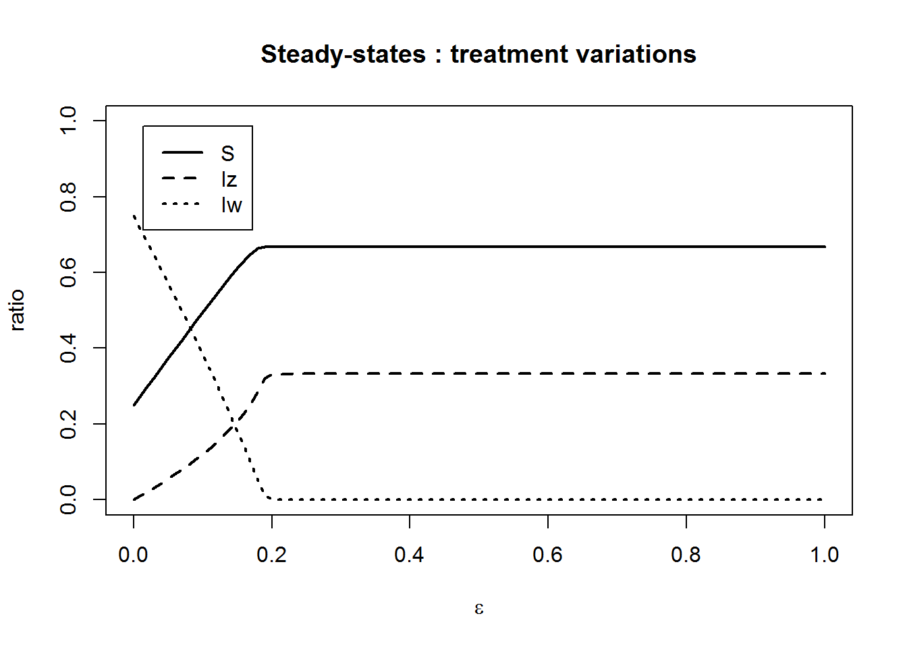
```

According to our model, the proportions of different populations change for the range of $\varepsilon$ (proportion of treated patients) between 0 and 20%. $I_w$ decreases linearly with the increase of $\varepsilon$. For now on, the behavior of our model will be analyzed for this span of $\varepsilon$ (!! relevance??).


##Steady states when varying $\rho$

```{r ss_rho_var, out.width = "600px", echo=FALSE, cache=TRUE, fig.align='center'}
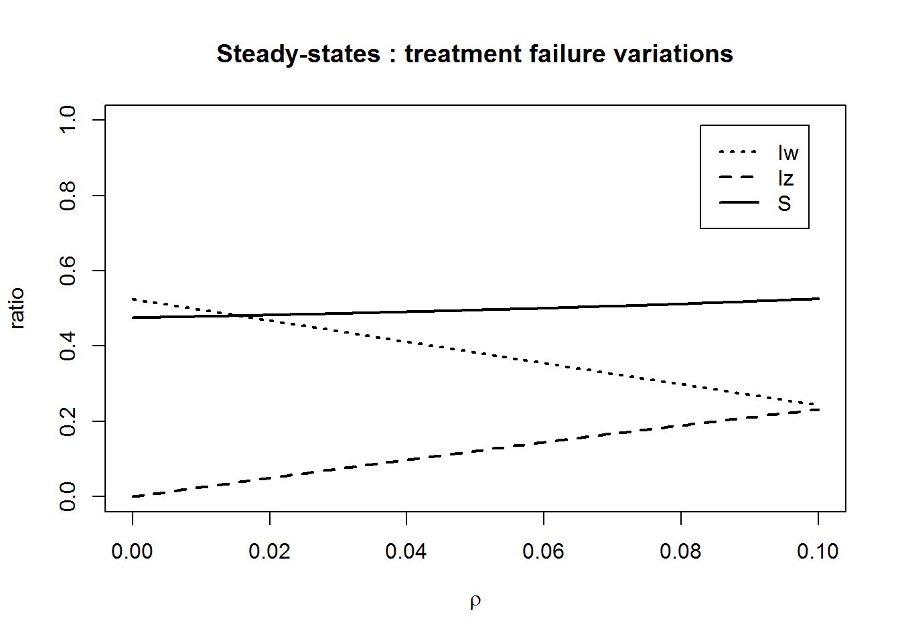
```

Based on literature, the proportion of treatment failures is between 4 and 8% (add a quote) for tuberculosis. It has a significant impact on the proportion of $I_w$ and $I_z$. When it increases the prevalence of $I_z$ increases at the expense of $I_w$, while the global burden of the disease decreases. Interestingly, when there is no treatment failure, there is no stable coexistence of sensitive and resistant strains in our model.

##Steady state QA when varying $\varepsilon$

We consider Quantity of antibiotics as being the burden of infection multiplied by the proportion of treated patients. In fact, usage of ATB in patients infected with resistant strains does not have any impact on patient's recovery in our model. Though, here we consider that the ATB are consumed in this subpopulation as well and at the same rate, which may be due to poor or late resistance detection in hospitals or to self-medication in population.

Therefore in this model, $QA = (I_w +I_z)*\varepsilon$.

The following plot represents the QA in function of $\varepsilon$. 

```{r, out.width = "600px", echo=FALSE, cache=TRUE, fig.align='center'}
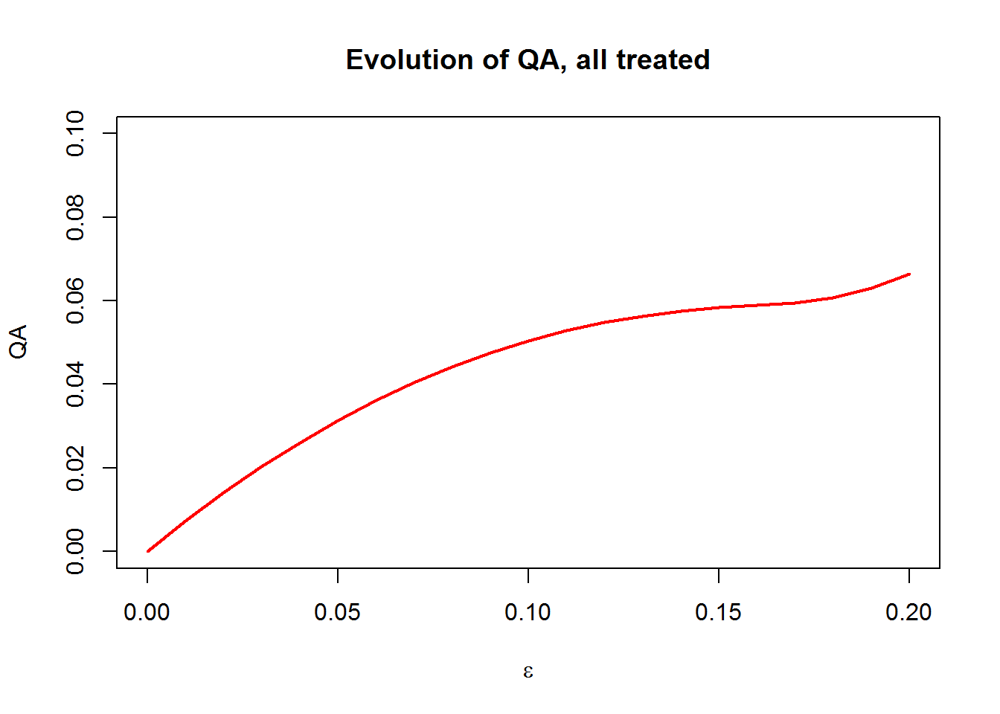
```

The first part of the graph results from a multiplication of a decreasing linear function ($I_w + I_z$) and an increasing linear function ($\varepsilon$). For extreme values of $\varepsilon$, there is a linear relation between QA and $\varepsilon$ as $I_w + I_z$ reaches stability.

This means that at steady states, with nearly the same quantity of antibiotics (0.050 and 0.06) nearly a double proportion of patients can be treated (10% and 17%).


##Steady state net flow in the model

The steady state flows from one population to another are followed for $\varepsilon$ varying between 0 and 20%.

```{r ss_flow_eps_var, out.width = "600px", echo=FALSE, cache=TRUE, fig.align='center'}
knitr::include_graphics("./AMU_var_incidence_files/figure-html/comp_inc_flows-1.png")
```

<center>
| Flow            | Comparison | Flow           |
|:---------------:|:----------:|:--------------:|
| $S$ to $I_w$    |      >     |$I_w$ to $S$    |
| $I_w$ to $I_z$  |      >     |$I_z$ to $I_w$  |
| $S$ to $I_z$    |      <     |$I_z$ to $S$    |
</center>

Therefore the net flow in our model is the following:

```{r, out.width = "200px", echo=FALSE, cache=TRUE, fig.align='center'}
knitr::include_graphics("C:/Users/Jakub/Desktop/Figures/NetFlow.png")
```

##Steady state resistance ratio p and burden of resistance

```{r, out.width = "600px", echo=FALSE, cache=TRUE, fig.align='center'}
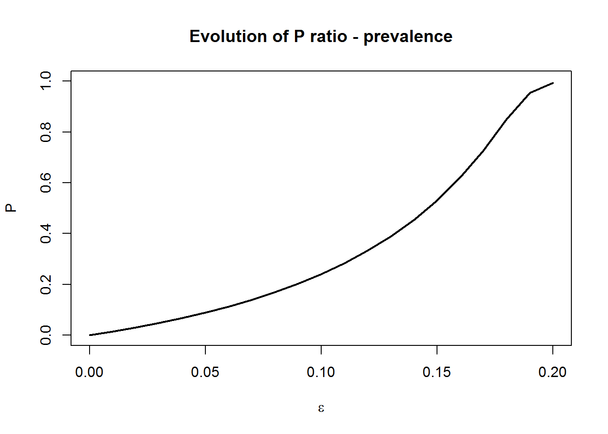
```

Here, the p corresponds to the ratio of prevalence at steady-states. Usually, it is used in the studies of tuberculosis (WHO 2002). Its exponential growth is due to the interplay of increasing $I_z$ and decreasing $I_w$.


```{r, out.width = "600px", echo=FALSE, cache=TRUE, fig.align='center'}
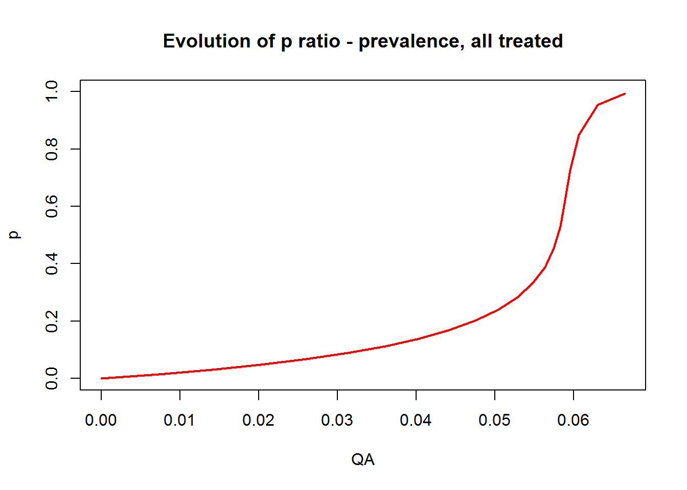
```

P as a function of QA shows an exponential growth with saturation, which is due to :

a) interplay of increasing $I_z$ and decreasing $I_w$ with increasing $\varepsilon$
b) saturation part of the curve of QA=f($\varepsilon$) ([0.050, 0.06] of QA corresponds to [10%,17%] of $\varepsilon$)

```{r, out.width = "600px", echo=FALSE, cache=TRUE, fig.align='center'}
knitr::include_graphics("./AMU_var_incidence_files/figure-html/ss_burden_of_inf-1.png")
```

Here, the burden of infection corresponds to the total proportion of infected people. It decreases linearly as the $\varepsilon$ increases, due to the decrease of $I_w$ that is faster than the increase of $I_z$.


```{r, out.width = "600px", echo=FALSE, cache=TRUE, fig.align='center'}
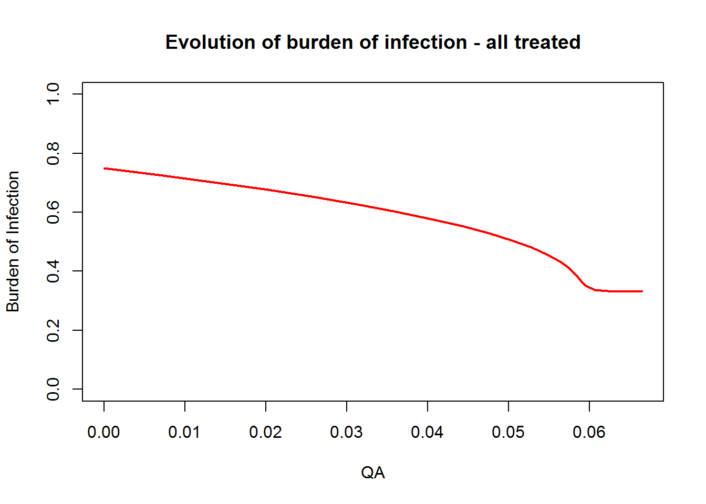
```

Finally, when plotting the BOI in function of QA, decreasing tendency is preserved. Before reaching a stability, there is a fastening decrease of BOI, which is once again due to the saturation tendancy in QA=f($\varepsilon$).

##Steady state incidence

```{r, out.width = "600px", echo=FALSE, cache=TRUE, fig.align='center'}

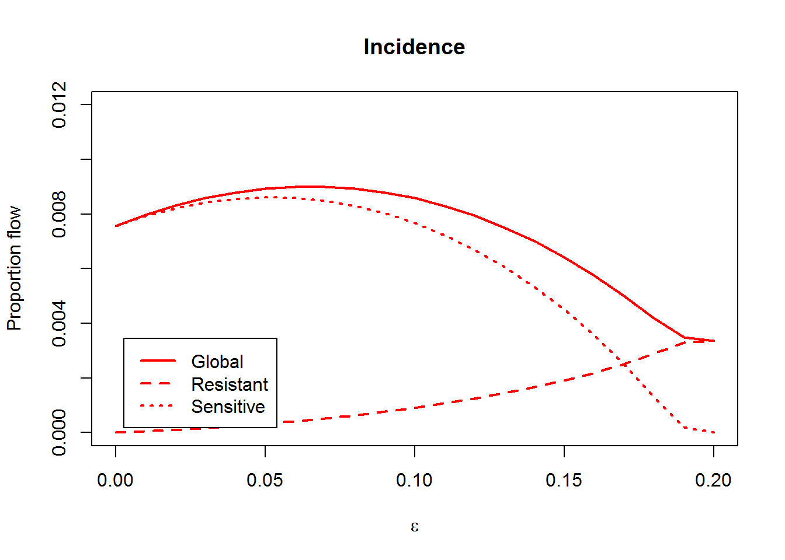
```

Though the burden of infection decreases linearly with the use of antibiotics, the global incidence evolves in a more complex way. There is a peak for incidence when app. 7% of the patients are treated. 

The increase of global incidence for lower values of $\varepsilon$, cannot be solely explained by the emergence of resistance and its spread : the incidence of sensitive infections increases until 5% $\varepsilon$. In fact, though the proportion of sensitive cases decreases very fast with $\varepsilon$ in comparison to the speed of increase of susceptible population, their product increases until app. 9% $\varepsilon$ and remains at equal or higher values of the situation without $\varepsilon$ until app. 11% of $\varepsilon$. The increasing spread of resistant infections explains then the delayed peak of global incidence in comparison with the sensitive one.

The global incidence then decreases to its value without antibiotic use at 14% $\varepsilon$.

```{r, out.width = "600px", echo=FALSE, cache=TRUE, fig.align='center'}

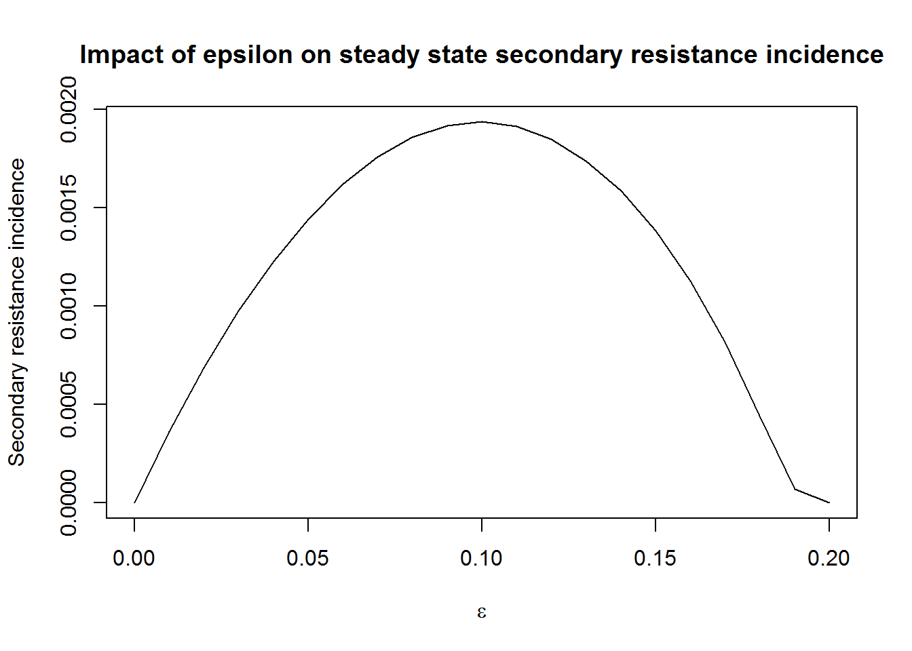

```

The situation where resistance emerges in a treated patient, comprehending a horizontal tranfer of AMR, $de$ $novo$ mutations and minor resistant population outcompeting its sensitive fellows, is called secondary resistance.

This resistance is represented in our model as a flow from $I_w$ to $I_z$ depending on the $\varepsilon$ and probability of acquiring resistance when treated. As we can see, it reaches a peak for 10% $\varepsilon$. For higher values of $\varepsilon$, the deterioration of $I_w$ population makes the secondary resistance plummet.

```{r, out.width = "600px", echo=FALSE, cache=TRUE, fig.align='center'}

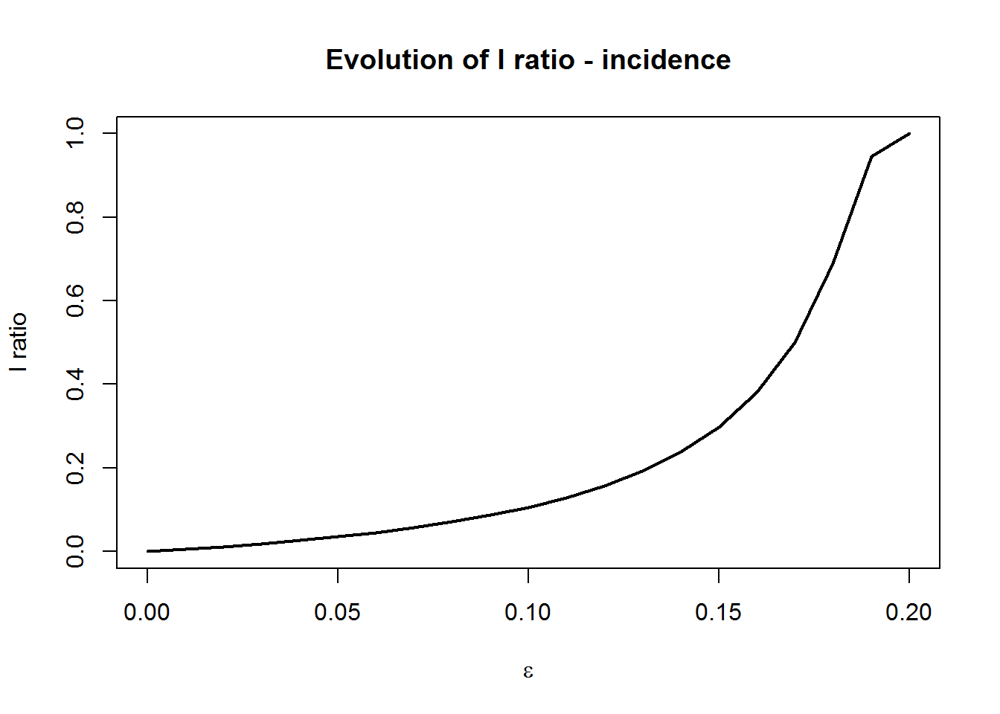

```

When relating p and QA, the proportion of resistant cases among new cases increases very steeply at higher values (0.050 ti 0.060) of QA. This is once again due to:

a) exponential increase in p=f($\varepsilon$)
b) relative steadiness in QA=f($\varepsilon$) for higher values of $\varepsilon$ (10 - 17%)


```{r, out.width = "600px", echo=FALSE, cache=TRUE, fig.align='center'}

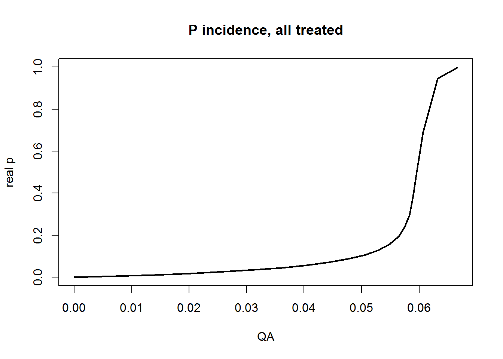

```


#Dynamics exploitation

In this part, we analyse the dynamics in our model. At time $t=0$, the steady state for $\varepsilon=10%$ was reached. Afterwards, the $\varepsilon$ changes to values between 0% and 20%.

##Dynamics of p after a change in $\varepsilon$

```{r, out.width = "600px", echo=FALSE, cache=TRUE, fig.align='center'}

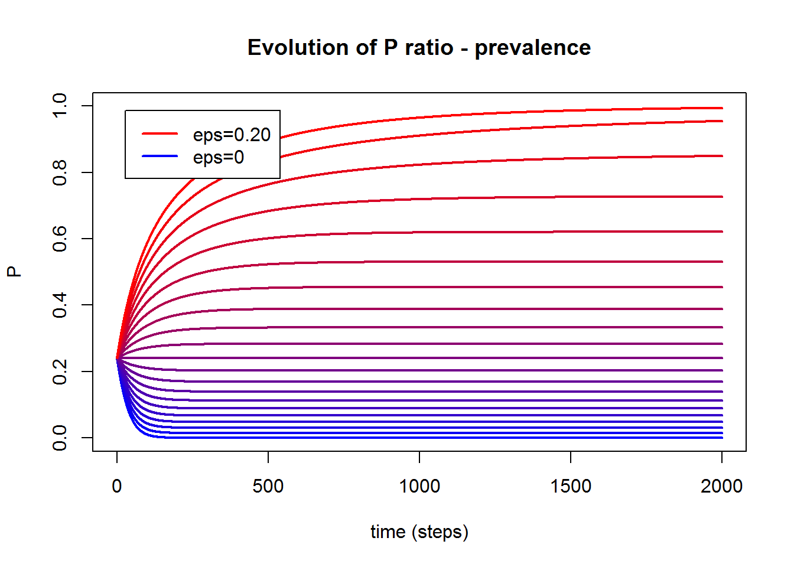

```

##Dynamics of Incidence

```{r, out.width = "600px", echo=FALSE, cache=TRUE, fig.align='center'}

knitr::include_graphics("./AMU_var_incidence_files/figure-html/new_cases_dynamics-2.png")

```

We have seen that at steady state the global incidence increases in the interval of 0% to 7% $\varepsilon$. This means that paradoxically, there are more new infections with higher level of $\varepsilon$.

Here, we see that in short-term dynamics, the incidence depends strongly on $\varepsilon$ : when $\varepsilon$ increases the global incidence decreases for each value of $\varepsilon$.

For lower values of $\varepsilon$, we can see a 

```{r, out.width = "600px", echo=FALSE, cache=TRUE, fig.align='center'}

knitr::include_graphics("./AMU_var_incidence_files/figure-html/S_to_Iw_flow-1.png")

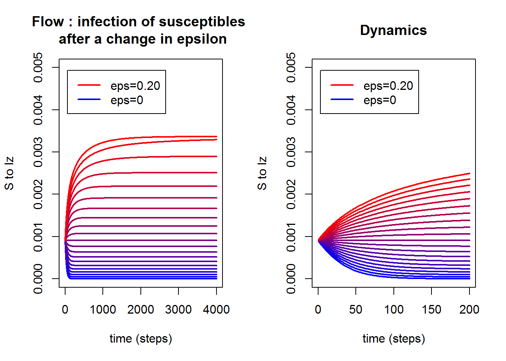

```

It is indeed the incidence of sensitive cases that is responsible for the short-term peaks of global incidence when $\varepsilon$ decreases. 

The susceptible incidence depends on mass product of $I_w$ and $S$.

We consider now a simpler model with only $I_w$ and $S$ populations, related with the same relationships as in our model. Do these short-term peaks in $I_w$ incidence appear as well? If it is so, the anti-honeymoon period is due only to the interplay between $I_w$ and $S$ when the $\varepsilon$ is suddenly decreased. The second possibility is that the transient anti-honeymoon period is due to the interplay between $I_w$ and $I_z$.

```{r, out.width = "600px", echo=FALSE, cache=TRUE, fig.align='center'}

knitr::include_graphics("./simple_models_files/figure-html/model_Iw_S-1.png")


```

The short-term peaks do not appear in a simpler model and thus this phenomenon is emerging due to the presence of $I_z$.

As the sensitive incidence, and thus the anti-honeymoon period, are directly dependent on the mass-product of $I_w$ and $S$, a change in flow between $I_z$ and $I_w$ may have a direct impact on the this mass product. In particular, the secondary resistance may be the cause of the short-term peaks as the variation of $\varepsilon$ has a huge and immediate impact on its strength : the decrease of $\varepsilon$ would decrease this flow and we would see a fast accumulation in $I_w$ population at the cost of $I_z$.

```{r, out.width = "600px", echo=FALSE, cache=TRUE, fig.align='center'}

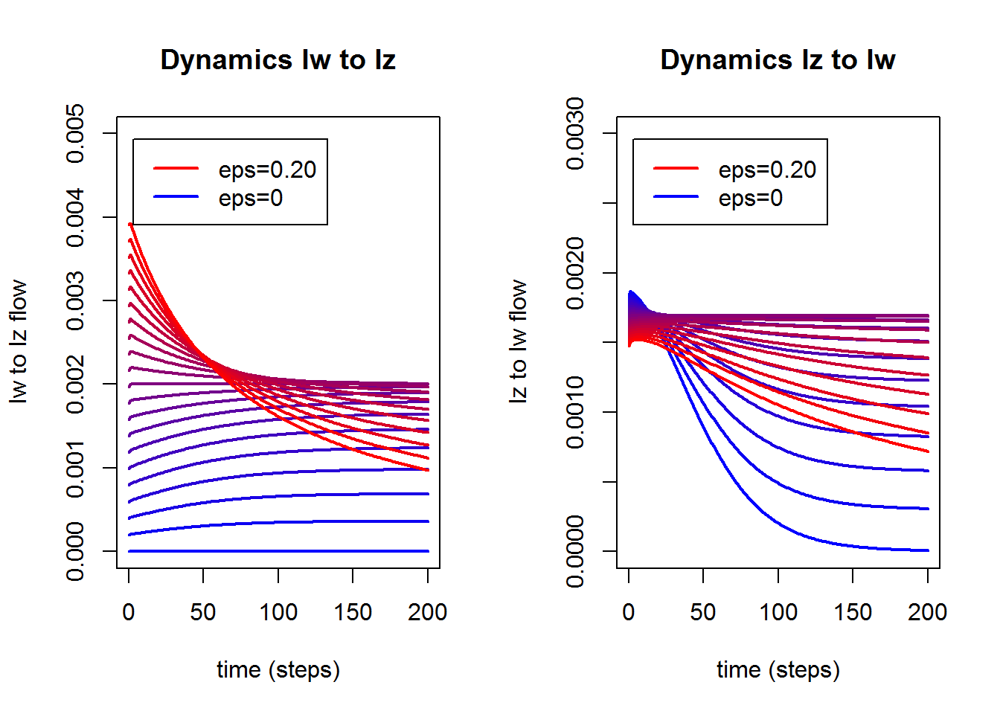

```

Concurrently to the presence of short-term peaks, the $I_w$ to $I_z$ flow, corresponding to the spread of resistance in infected cases, plummets. In fact, the decrease of $\varepsilon$ has an immediate effect on this flow. Meanwhile the impact on the loss of resistance ($I_z$ to $I_w$ flow) is slower : it reaches the minimum value by the 150th step.

Finally, dynamics in recovery of infected cases may contribute as well to the anti-honeymoon period : as the $\varepsilon$ is suddenly decreased, the expectancy of duration spent in $I_w$ population should increase. This would then transiently promote the accumulation of sensitive cases and therefore the possibility of transmission.

```{r, out.width = "600px", echo=FALSE, cache=TRUE, fig.align='center'}

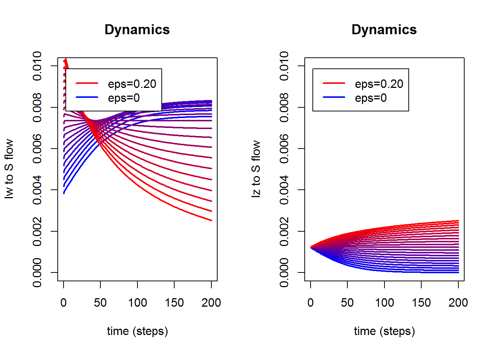

```

As we can see, the recovery dynamics of sensitive cases after a sudden decrease of $\varepsilon$ are in accordance with our hypothesis and contribute to the anti-honeymoon effect.

The anti-honeymoon effect, following an abrupt drop in $\varepsilon$, is a consequence of several phenomena:

a. The flow from $I_w$ to $I_z$ is suddenly cut, while the flow in opposite direction slows slowly, resulting in a redistribution of infected cases.
b. The average duration of sensitive infection becomes longer, resulting in accumulation of sensitive cases.
c. As a result of the accumulation of sensitive cases, the mass product of $S$ and $I_w$ increases. In consequence, the $S$ is transiently drawn by $I_w$.


Finally, we represent here the net flows between the three subpopulations after a change in $\varepsilon$:

```{r, out.width = "800px", echo=FALSE, cache=TRUE, fig.align='center'}
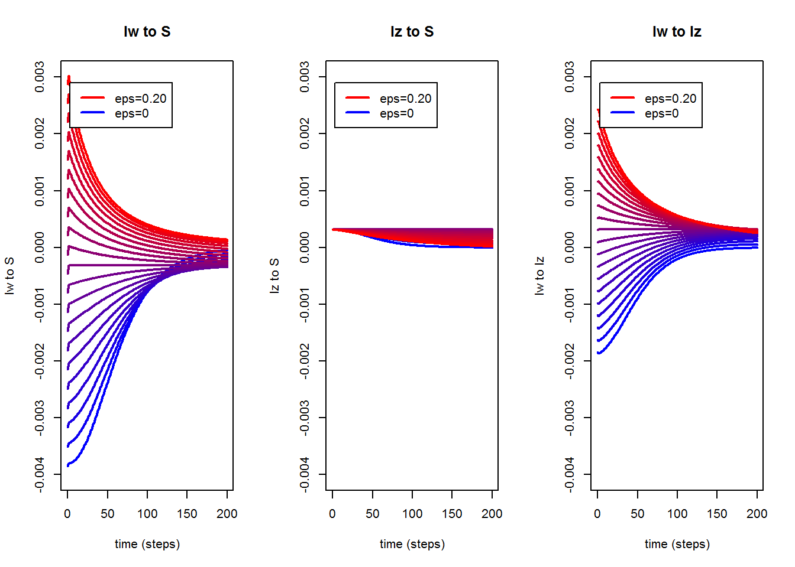
```

We can notice that $I_w$ to $S$ and $I_w$ and $I_z$ net flows are discontinuous because some of their components ($I_w$ to $S$, $I_w$ to $I_z$ and $I_z$ to $I_w$ flows) depend directly on $\varepsilon$ changing abruptly at t=0. On the otherhand $I_z$ to $S$ net flow is continuous because each of its components is independent on $\varepsilon$.

During short-time period after a sharp decrease in $\varepsilon$, the net flows in our model are as follows:

```{r, out.width = "200px", echo=FALSE, cache=TRUE, fig.align='center'}
knitr::include_graphics("C:/Users/Jakub/Desktop/Figures/Sharp decrease in AMU.png")
```

At sharp increase of $\varepsilon$ the net flows in our model change as well:

```{r, out.width = "200px", echo=FALSE, cache=TRUE, fig.align='center'}
knitr::include_graphics("C:/Users/Jakub/Desktop/Figures/Sharp increase in AMU.png")
```


#Inhibition of certain functions in our model

##Inhibition of interhost competition

To inhibit the interhost competition in our model, $\beta_z$ takes the value of $0.4$ that is to say becomes equal to $\beta_w$.

The steady state values of state variables are the following:

```{r,echo=FALSE, out.width="400px", fig.width=3, fig.height=3,fig.show='hold',fig.align='center'}

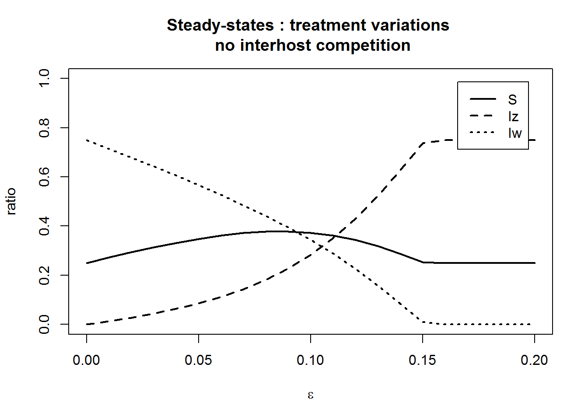
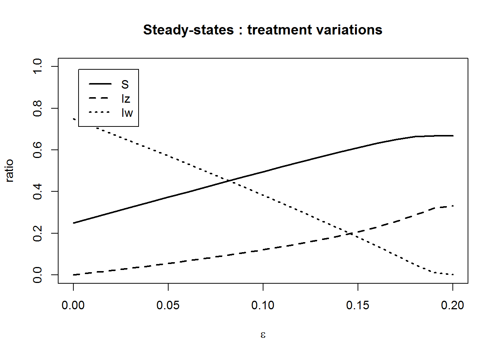
```

We observe therefore coexistence of the strains for values of $\varepsilon$ between approximately 0 and 15%. When $I_z$ is fixed, it has the same value as $I_z$ prevalence during prebiotic era.

Interestingly, when no ATB is used, resistant strain does not coexist with the sensitive one due to indirect cost linked to co-infections. Although no direct cost of resistance is included in this particular model, when resistant cases are reinfected with sensitive strains, the sensitive strain prevails.

Paradoxically the prevalence has the lowest value for $\varepsilon$ of 10% due to indirect competition. The incidence is highest at the same time as the turnover of sensitive cases is highest (we observe a peak of $I_w$ and $S$ mass product). It returns to pre-antibiotic era as $I_z$ becomes fixed.

```{r, out.width = "400px", echo=FALSE, cache=TRUE, fig.align='center'}
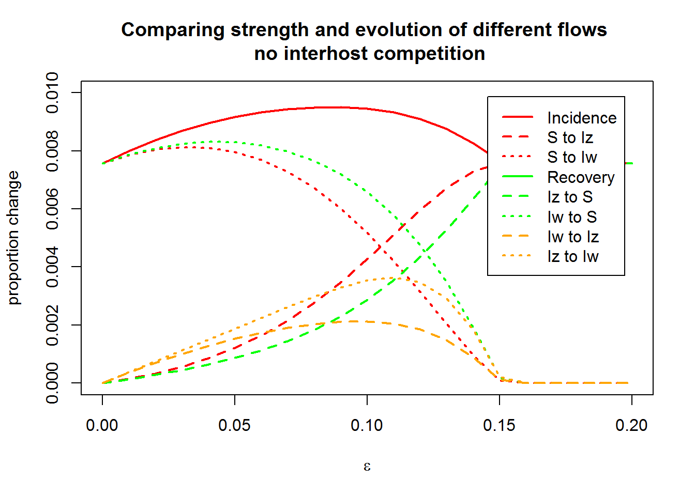
knitr::include_graphics("./AMU_var_incidence_files/figure-html/comp_inc_flows-1.png")
```

As there is no cost of resistance, the interplay between resistant and sensitive strain will depend solely on $\varepsilon$ and $\rho$. As $\varepsilon$, that corresponds to the $\varepsilon$ here, increases, a higher turnover of sensitive cases occurs, while the flow from $I_w$ to $I_z$ increases at the expense of $I_z$ to $I_w$ flow.

Interestingly but not surprisingly, the global flows in our model are inversed in comparison with a model including cost of resistance. This is due to the fact that $I_z$ spreads as easily as $I_w$. At the same time, patients infected with $I_w$ do recover more easily than those infected with $I_z$ as $\varepsilon$ increases. Therefore there is a stronger flow from $I_w$ to $S$ than from $I_z$, when the populations are equal.

```{r, out.width = "200px", echo=FALSE, cache=TRUE, fig.align='center'}
knitr::include_graphics("C:/Users/Jakub/Desktop/Figures/No cost on transmission.png")
```

In comparison with the full model, the primary resistance becomes predominant over the secondary one for lower values of $\varepsilon$, as the resistant bacteria are better transmitted (10% vs 13%). For most diseases, the secondary resistance is estimated to be more prevalent.

```{r, out.width = "400px", echo=FALSE, cache=TRUE, fig.align='center'}
knitr::include_graphics("./model_no_competition_inc_files/figure-html/comp_steady_st-1.png")
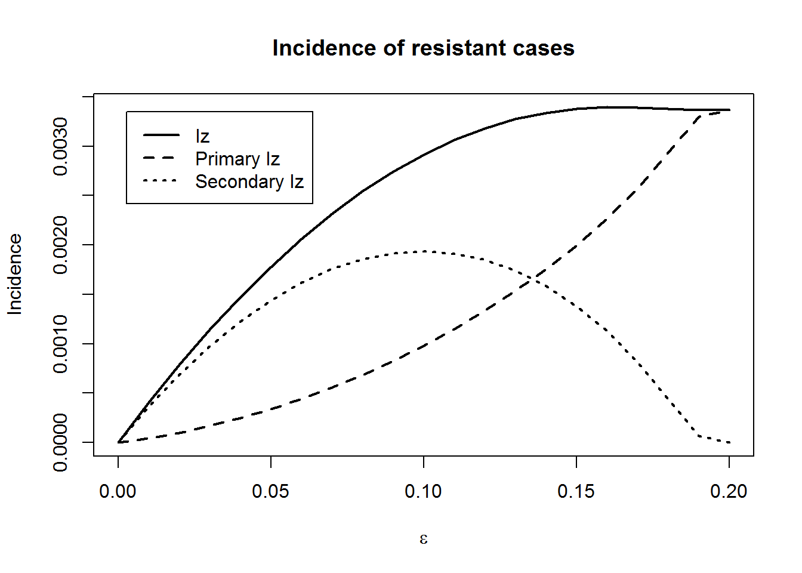
```

In general, when the transmission cost increases, $i.e.$ the $\beta_z$ decreases while $\beta_w$ remains stable, $I_z$ is fixed and becomes prevalent for higher values of $\varepsilon$.


```{r ss_rho_var_no_cost, out.width = "400px", echo=FALSE, cache=TRUE, fig.align='center'}
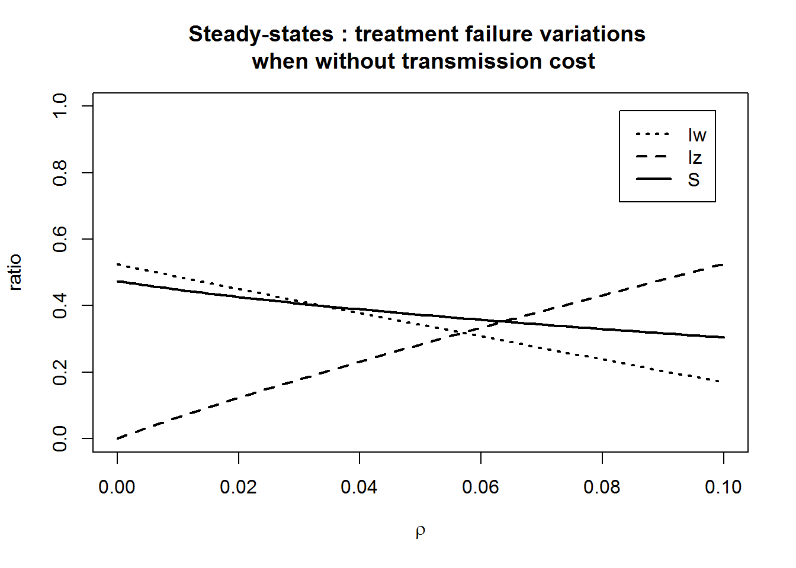

```

Consistant with the above-mentioned findings, when $\rho=0$, $i.e.$ there is no treatment failure and therefore no secondary resistance, resistant strain cannot coexist.

Moreover unlike in the situation where the transmission cost does exist, the global burden of infection increases with $\rho$. This is due to the fact, that the resistant strain has the behaviour of a sensitive one in antibiotics-free environment. Therefore, at values of $\rho$ incompatible with $I_w$ coexistence ($\rho$>0.15), $I_z$ gains the same levels as $I_w$ in antibiotics-free environment ($I_z$=0.75; data not shown).


##Inhibition of secondary resistance

When only primary resistance is preserved, that is to say $\rho=0$, we observe that the coexistence is very limited (for $\varepsilon$ between 0.27 and 0.29).

```{r, out.width = "400px", echo=FALSE, cache=TRUE, fig.align='center'}
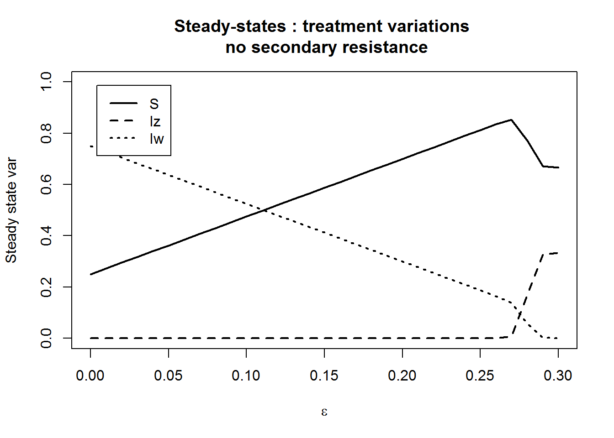
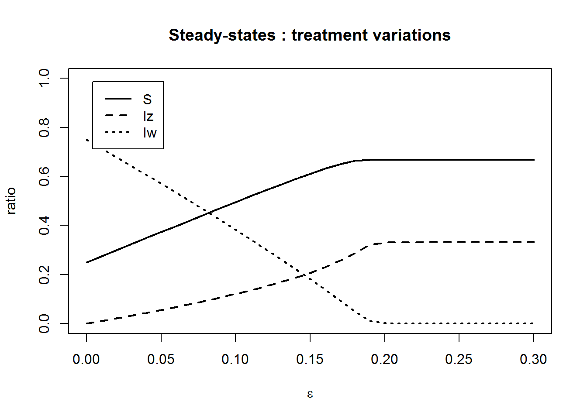
```

Although the model was started with an important subpopulation of $I_z$ (_cca_ 12%), this subpopulation has vanished at steady state, being systematically converted into $I_w$. The stability of $I_z$ subpopulation is therefore substantially dependant on the secondary resistance in long term.

```{r, out.width = "400px", echo=FALSE, cache=TRUE, fig.align='center'}
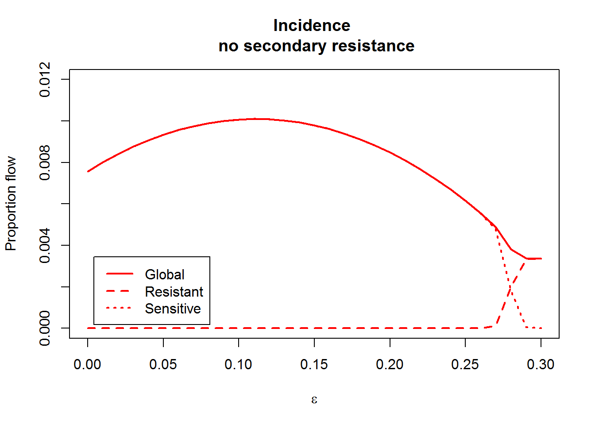

```

Without secondary resistance, the flows between $I_w$ and $I_z$ reach equilibria when $\beta_w*(1-\varepsilon)=\beta_z*\varepsilon$, that is to say when $\varepsilon=0.73$. The emergence of stable state is therefore rather linked to the upraise of $S$ values due to enhanced treatment than to the inversion of flows between $I_z$ and $I_w$.

##Inhibition of primary resistance

Here, the primary resistance is omitted, $i.e.$ $beta_z=0$ and the resistant strains cannot be transmitted.

```{r, out.width = "400px", echo=FALSE, cache=TRUE, fig.align='center'}
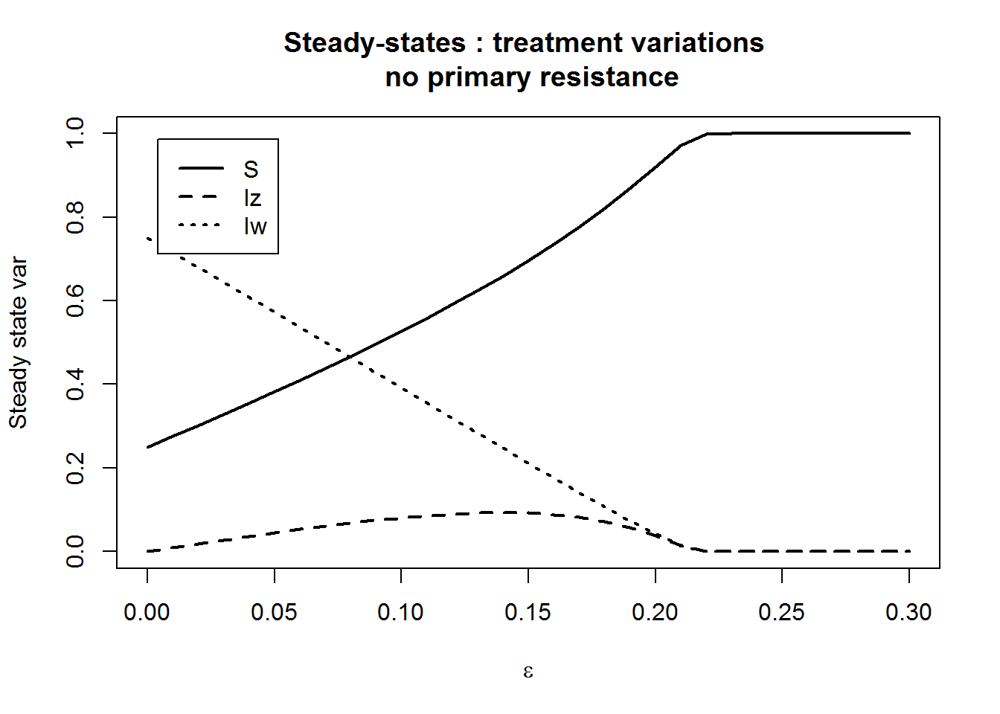
```

Although the transmission of resistant strains is omitted and therefore the pool of resistant cases is fully dependant on treatment failures, the coexistence is observed for $\varepsilon$ < 25% at steady states. Not surprisingly, the resistant cases vanish at the same time as sensitive ones do.


```{r, out.width = "400px", echo=FALSE, cache=TRUE, fig.align='center'}
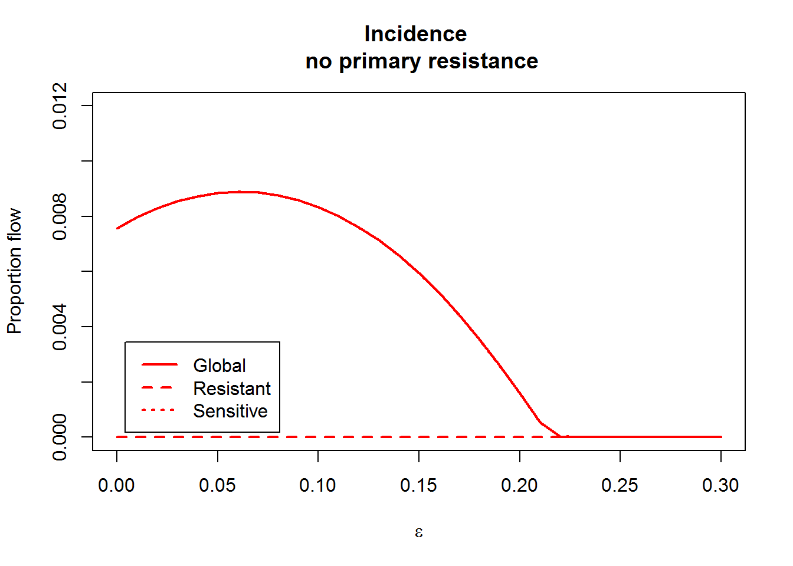
```

In comparison with a simple model in which only susceptible population and sensitive strains are present, the incidence is smaller for the same $\varepsilon$. This is due to the treatment failures : in fact, the $I_z$ will represent here a dead-end for the pathogen that cannot be transmitted.


#Study of hysteresis

The study of hysteresis allows to know whether the same stable states can be reached while increasing proportion of treated patients from a low state ($\varepsilon=0.00$) or decreasing it from a high state ($\varepsilon=0.18$). We opt to consider only the stable states in a relatively short interval of $\varepsilon$ ([0, 0.18]) so to prevent $I_w$ from reaching irrescuable 0 (there is no possibility to re-establish $I_w$ population).

Once the $\varepsilon$ stabilizes over 0.18, there is a point of no return, not allowing the sensitive bacteria to re-establish. This is due to the fact, that in our model there is no possibility of reversion of resistant mutants which seems to be realistic considering today's research (changing genetic background and eventual compensatory mutations will make reversion highly unlikely).

```{r, out.width = "600px", echo=FALSE, cache=TRUE, fig.align='center'}
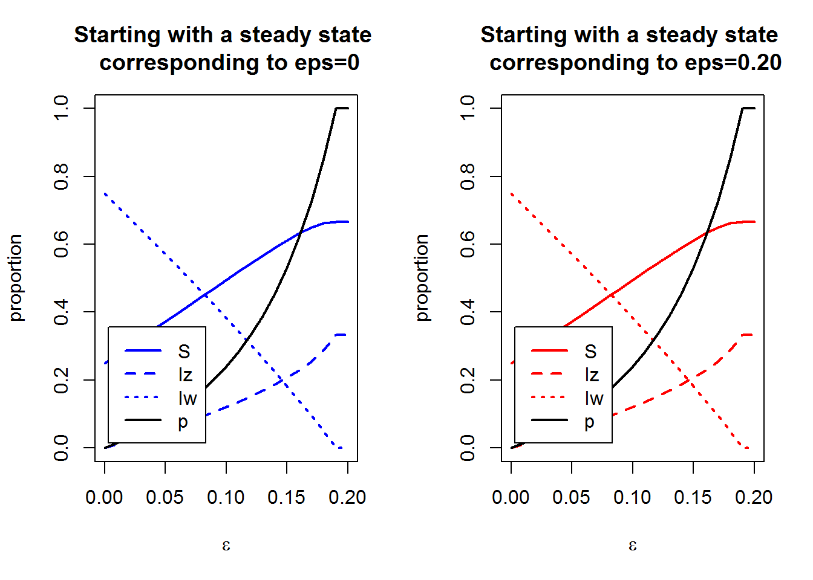
```

The back and forth pathways being the same, we can say that there is no hysteresis in our model. Therefore, theoretically resistant cases can be diminished by reduced use of antibiotics. The question now is whether the changing $\varepsilon$ has the same effect within the same timespan. This brings us to the study of inertia.


#Study of inertia

##Varying the speed of change of $\varepsilon$

In this part, we vary rate at which the proportion of patients varies, still considering that the proportion of patients is directly linked to the $\varepsilon$. At first, we start from $\varepsilon$=0 and increase its value up to 100%.

```{r, out.width = "600px", echo=FALSE, cache=TRUE, fig.align='center'}
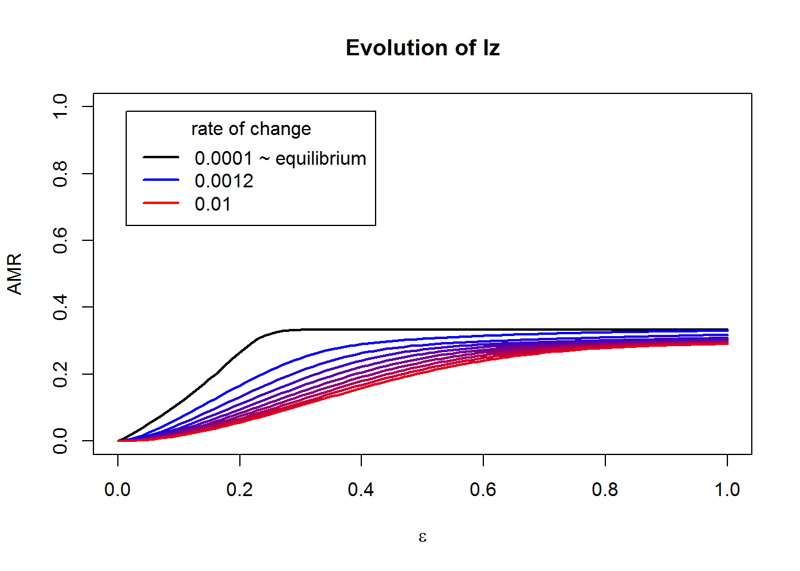
```

As the rate of change increases, the proportion of $I_z$ is more distant from its steady state value. The rate of change of $\varepsilon$ can thus have a severe impact on the detected resistance level. Presuming that all hospitals are in equilibrium can be a rough simplification.

```{r, out.width = "600px", echo=FALSE, cache=TRUE, fig.align='center'}
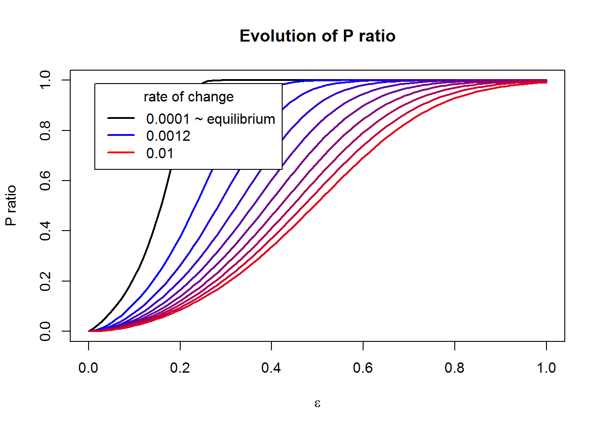
```

Delay in reaching equilibrium due to rapid increase of $\varepsilon$ can be observed for the p (defined as the ratio between $I_z$ and burden of infection) as well.

The question is now whether there are the same times are required for  reaching equilibrium (TREs) while increasing or decreasing $\varepsilon$.

##Time to reach equilibrium while increasing or decreasing $\varepsilon$

The idea is to compare the number of steps that are required for reaching a steady state while either increasing or decreasing the value of $\varepsilon$.

The model starts at a steady state for a given value of $\varepsilon$. Then the $\varepsilon$ is increased or decreased by certain $\delta$ and the time required for reaching equilibrium (TRE), represented by a value of convergience criterion (here $c$=0.000001). The output is the following comparison of TREs for each final value of $\varepsilon$:

```{r, out.width = "600px", echo=FALSE, cache=TRUE, fig.align='center'}
knitr::include_graphics("C:/Users/Jakub/Desktop/Spicknall_partial_models_data/inertie_study_time_to_equilibrium_files_crit_0.000001/figure-html/time_to_stabilization_plot-1.png")
```

For higher values of $\varepsilon$, when the proportion of treated patients is decreased, it takes longer time to reach the steady state. There are too phenomena responsible for the observed time lapse.

As the $\varepsilon$ comes closer to the value of 0.18, the time to reach equilibrium while decreasing its value becomes theoretically infinity. This is due to the fact that there is no possible return from a stable state where $I_w$ reaches zero (for the sake of simplification our model does not take into account revertants).

For smaller values of epsilon, there still exists a time lapse. The point of no return, observed in our model, cannot be responsible for this finding. Let us focus on the interval of $varepsilon$ where it does not intervene.

```{r, out.width = "600px", echo=FALSE, cache=TRUE, fig.align='center'}
knitr::include_graphics("C:/Users/Jakub/Desktop/Spicknall_partial_models_data/inertie_study_time_to_equilibrium_files/figure-html/plot_dif-1.png")
```

Here, the plot represents the time lapse between reaching equilibrium while decreasing and increasing $\varepsilon$, either with a large or small $\delta$ (0.01 and 0.001). For each value of $\delta$, the time lapse is strictly positive and increases with the final value of $\varepsilon$. Therefore, in general the steady state is reached with a bigger delay while the proportion of treated patients is decreased than when it is increased by the same value.

We can compare the differences obtained with different values of $\delta\varepsilon$ (0.01 and 0.001) while using the same metrics such as $\frac{\delta t}{\delta \varepsilon}$ :

```{r, out.width = "600px", echo=FALSE, cache=TRUE, fig.align='center'}
knitr::include_graphics("C:/Users/Jakub/Desktop/Spicknall_partial_models_data/inertie_study_time_to_equilibrium_files/figure-html/plot_same_metrics-1.png")
```

Though the TRE is smaller for smaller values of $\delta\varepsilon$, when using the same metrics, the lapse per "step of $\varepsilon$ is bigger. We can imagine, that there is simply a 'time cost' related to the approaching of steady state and thus TRE of a big leap in terms of $varepsilon$ is not equal to the sum of TREs of intermediate steady states.

There is another possibility how to present this phenomena. In the following experiment, the steady states are reached for $\varepsilon$=0.00 and $\varepsilon$=0.17. Then it changes to a value between 0.01 and 0.16 and the time to reach the equilibrium is calculated as well as the difference of the times for given initial $\varepsilon$. Here, the convergence criterion is 0.0001.

```{r, out.width = "600px", echo=FALSE, cache=TRUE, fig.align='center'}
knitr::include_graphics("C:/Users/Jakub/Desktop/Spicknall_partial_models_data/inertie_study_time_to_equilibrium2_files_c_0.0001/figure-html/plotting-1.png")
```

```{r, out.width = "600px", echo=FALSE, cache=TRUE, fig.align='center'}
knitr::include_graphics("C:/Users/Jakub/Desktop/Spicknall_partial_models_data/inertie_study_time_to_equilibrium2_files_c_0.0001/figure-html/plotting-2.png")
```

Once again, when the $\varepsilon$ value is decreased, the steady state is reached with a delay for most of its final values.


#Detailing AMU

##Definitions, understanding DDD

In the previous parts, the AMU in the model was assimilated to the proportion of treated patients. In reality, the AMU is reported as defined daily doses (DDD) per patient/occupied bed per day. Therefore it is a combination of the treatment duration, concentration of daily doses and the number or proportion of patients.

$DDD/pt/d = \varepsilon*DC*t$

In fact, each of these three components may have an impact on the emergence and spread of resistance. 

$\varepsilon$ intervenes in the recovery of patients, in the secondary resistance and the outcome of intrahost competition.

Concentration intervenes in the mutation rate enabling resistant mutants to appear and in the selection of the mutant. Several recent papers showed that the outcome of mutant selection depends on the relative position of growth rate curves as the function of drug concentration. The difference between the growth rates of a wild type and mutant strains represents selective coefficient. Its value influences the outcome of selection.

Time of treatment can intervene in the mutation selection. It has been shown that short and long drug administrations have the same efficiency, while with the length of drug administration, the probability of secondary resistance increases.

In the following parts, we will try to implement a more detailed version of the AMU in the model in order to see the possible impacts of an intrinsic bias linked to the aggregated AMU reports.

For the sake of clarity, we opt to use at first the Drug quantity per patient (DQ), and consider that it has the same impact as the drug concentration on the selection outcome. Therefore we have:

$DQ = DC*t$

The drug quantity used per patient will then have an impact on the mutation rate and the selective coefficient.

##Model with a detailed version of AMU

###Impact of DQ on mutation rate and selective coefficient

In contrast with our first model, the AMU is not considered as directly linked to the proportion of treated patients, but as a product of proportion of treated patients and the drug quantity used per patient.

It has been shown that the mutation rate, here the rate at which resistant mutants appear, grows with increasing DQ/DC (??? source). Here we thus represent the mutation rate as a growing function of DQ.

```{r, out.width = "600px", echo=FALSE, cache=TRUE, fig.align='center'}

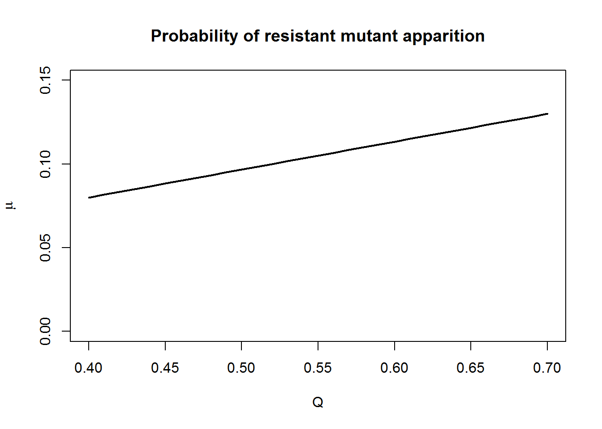
```

As it has been mentioned above, we consider that the drug quantity has an impact on resistant mutant selection in intrahost dynamics. This impact will depend on the relative position of growth rate curves of mutant and resistant strains.

```{r, out.width = "600px", echo=FALSE, cache=TRUE, fig.align='center'}

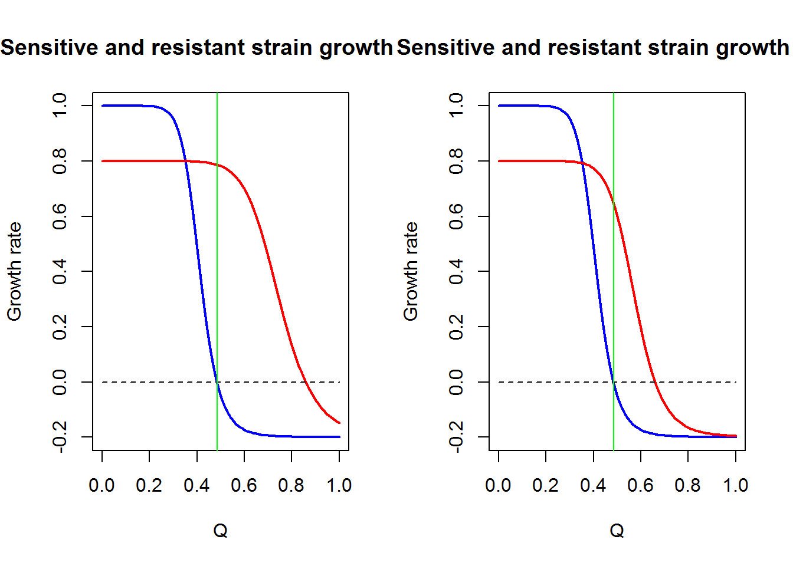
```


```{r, out.width = "600px", echo=FALSE, cache=TRUE, fig.align='center'}

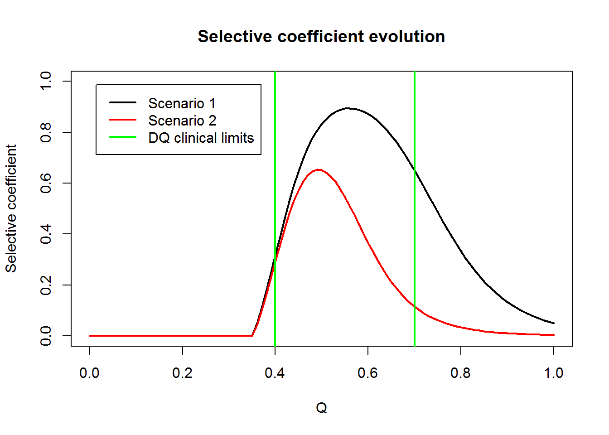
```


Here, we will consider two basic scenarios, anticipated by Troy Day et al. In the first one, the selective coefficient is lowest for the lowest used drug concentration, i.e. the optimal strategy for preventing resistant selection corresponds to the lowest drug concentration (or drug quantity in our simplified model). In the second one it is the oposite : the selective coefficient is lowest for the highest value of drug concentration in the selection window.


###The outcome of selection

The outcome of selection will then depend on the product of selective coefficient and mutation rate as following :

```{r, out.width = "600px", echo=FALSE, cache=TRUE, fig.align='center'}

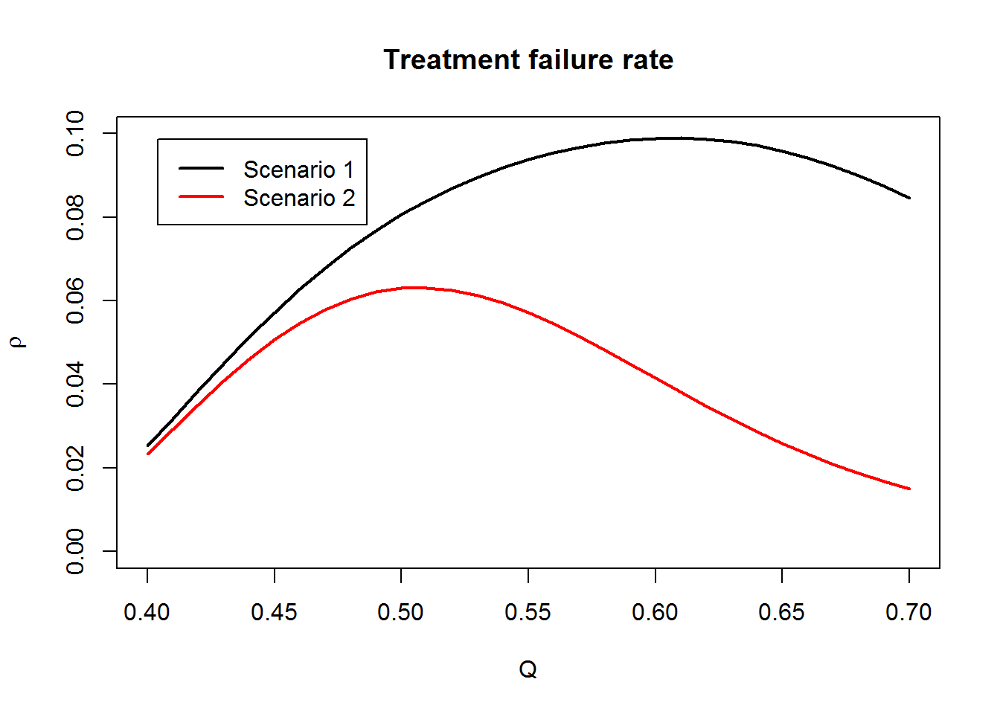
```

For each value of DQ, the treatment failure rate $\rho$ will therefore take a different value in the model.

###The proportion of treated patients

In order to exploit, to what extent the different combinations of $\varepsilon$ and $DQ$ can influence the model, the AMU is fixed at certain value for a given series of simulations. The AMU is fixed as well as a range of $DQ$, the $\varepsilon$ is therefore determined for each value of $DQ$:

```{r, out.width = "600px", echo=FALSE, cache=TRUE, fig.align='center'}

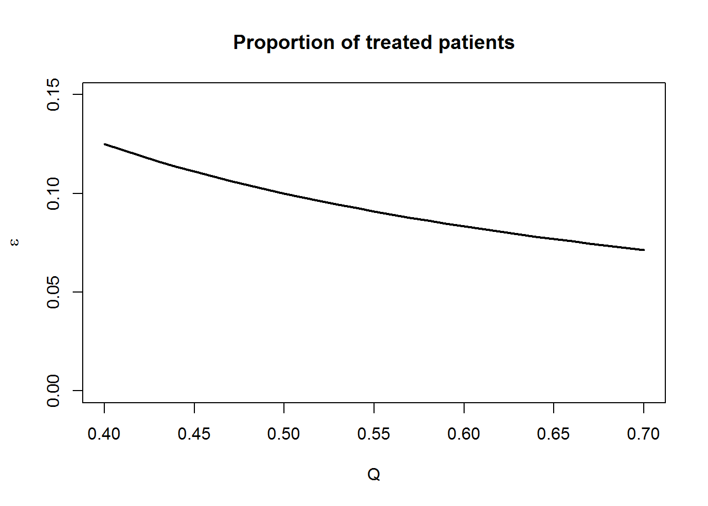
```

###Impact of possible DQ-$\varepsilon$ combinations on steady-states

For a given value of AMU (0.2), the modeling is performed for both scenarios. Then the steady states are evaluated.

```{r, out.width = "600px", echo=FALSE, cache=TRUE, fig.align='center'}

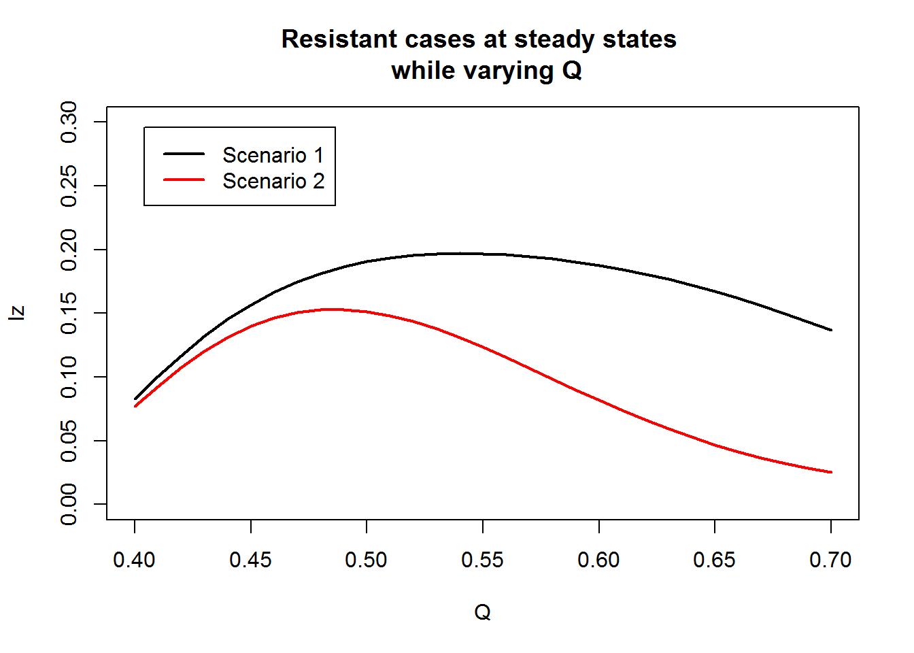
```

```{r, out.width = "600px", echo=FALSE, cache=TRUE, fig.align='center'}

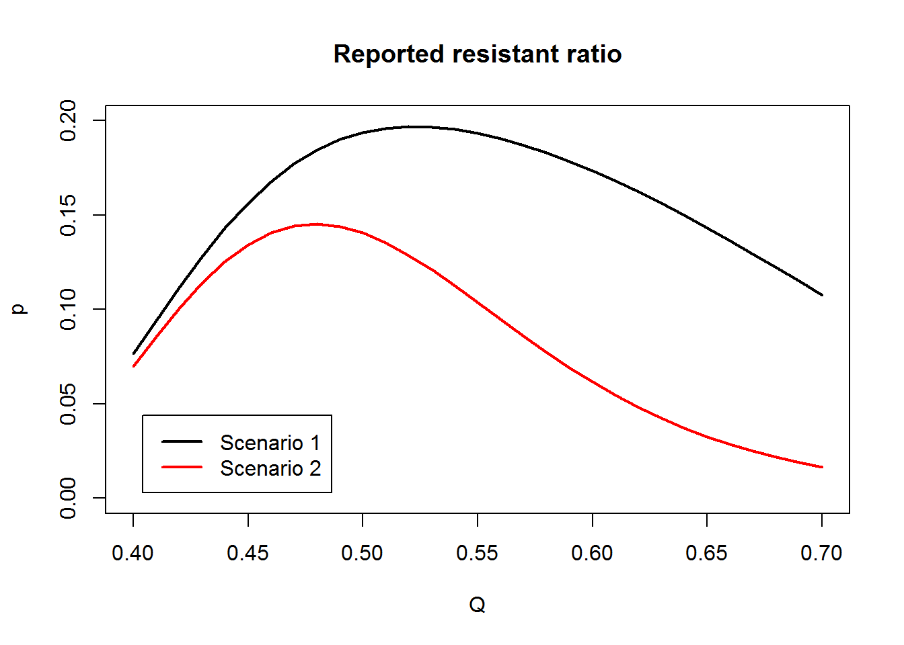
```

The combination of DQ and $\varepsilon$ has a big impact on the steady states.

In the first scenario, the maximum reached $I_z$ at steady state is twice as high as the minimum, while in the second one 5 times. Similar behaviour is observed for the reported p ratio.

The impact is even bigger on the reported resistant ratio $p$ (2.5 fold and 7 fold difference).

Interestingly, the same form of the curve as that of treatment failure rate is observed in both plots, though the maximum are switched to the left (A analyser plus tard). For increased values of DQ the values of p are lower, which can be linked to the $\varepsilon$ that is decreasing with increasing drug combination and therefore the susceptible cases are cleansed at lower rate.

Meanwhile, the impact of global burden of disease shows a very little of difference (around 25%) for different combinations:

```{r, out.width = "600px", echo=FALSE, cache=TRUE, fig.align='center'}

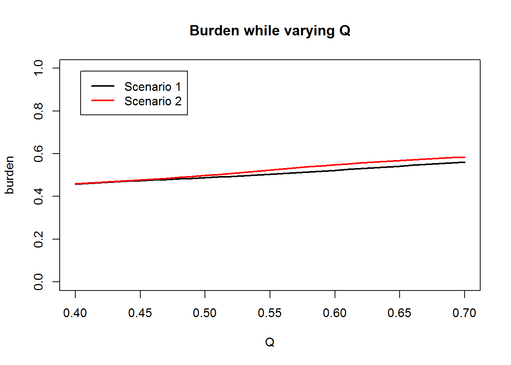
```

The burden of the disease increases with the drug quantity which is once again due to the lower recover rate of sensitive cases linked to lower values of $\varepsilon$.

###Varying AMU

In this part, exactly the same series of simulations are performed and compared for increasing values of AMU.

```{r, out.width = "600px", echo=FALSE, cache=TRUE, fig.align='center'}

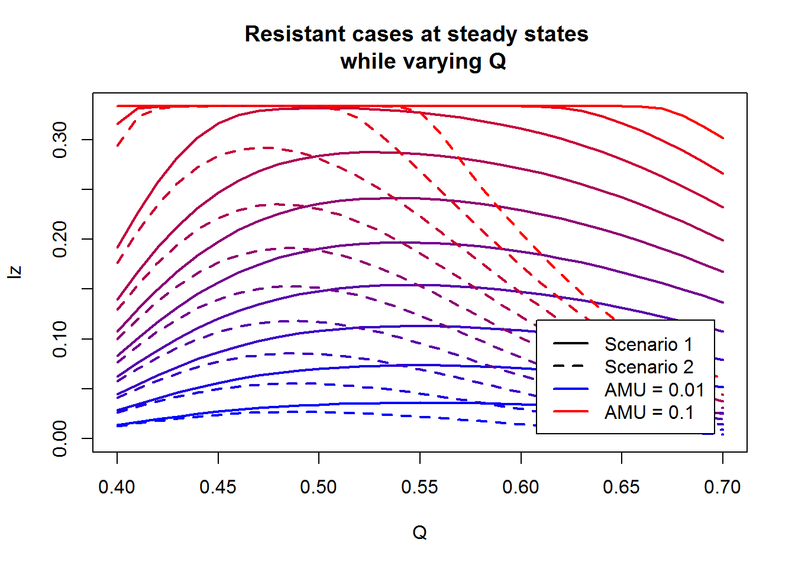
```

```{r, out.width = "600px", echo=FALSE, cache=TRUE, fig.align='center'}

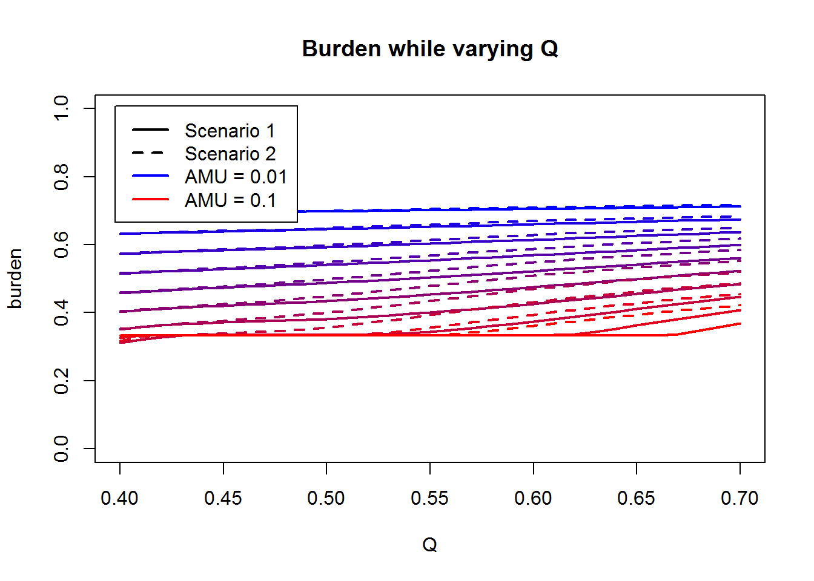
```

VA ETRE ANALYSE PROCHAINEMENT.