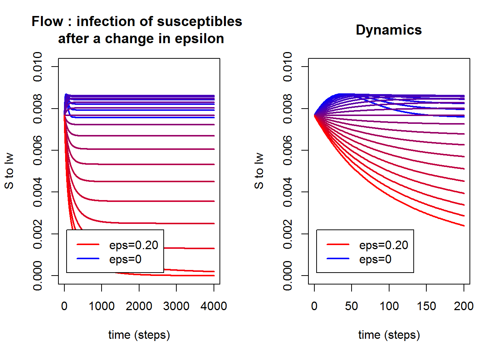

<center> <h3> Definition of the model </h3> </center>

```{r, out.width = "200px", echo=FALSE, cache=TRUE, fig.align='center'}
knitr::include_graphics("C:/Users/Jakub/Desktop/Figures/Mechanistic model of AMR spread.png")
```

$$
\begin{aligned}
\frac{dS}{dt} &=- \beta_w I_wS - \beta_z I_z S + \gamma  I_z + \gamma(1 - \varepsilon)I_w + \gamma `  \varepsilon  I_w \\
\frac{dI_w}{dt} &=\beta_w I_wS + (1-\varepsilon)\beta_wI_wI_z - \gamma(1 - \varepsilon)I_w - \gamma `  \varepsilon  I_w - \varepsilon\beta_zI_zI_w - \rho\varepsilon I_w \\
\frac{dI_z}{dt} &=\beta_z I_zS + \varepsilon\beta_zI_zI_w + \rho\varepsilon I_w - \gamma  I_z - (1-\varepsilon)\beta_wI_wI_z \\
\end{aligned}
$$

<center> <h3> State variables </h3> </center>

Name of state variable | Description
-----|--------------------------------------------------
$S$ | proportion of population that is susceptible
$I_w$ | proportion of population that is infected with sensitive strain
$I_z$ | proportion of population that is infected with resistant strain


<center> <h3> Parameters </h3> </center>

Name of Parameter | Description
-----|--------------------------------------------------
$\beta_w$ | transmission rate of sensitive strain
$\beta_z$ | transmission rate of resistant strain
$\varepsilon$ | proportion of infected people treated with antibiotics, supposedly strongly correlated to AMU
$\gamma$ | innate recovery rate (relative to $I_z$ generally and to $I_w$ | not treated with antibiotics)
$\gamma '$ | recovery rate of $I_w$ when treated with antibiotics
$\rho$ | proportion of treatment failures in $I_w$ (comprehensing _de novo_ mutations, outcompetition of major sensitive strain by minor resistant one and horizontal transfer)


<center> <h3> Derivatives </h3> </center>
$$
\begin{aligned}
\frac{dp}{dt} &= p(1-q)\beta_z - p(1-q)[(1-p)\beta_w + p\beta_z] - p(1-p)[\gamma-\left( \gamma(1-\varepsilon)+\gamma'\varepsilon\right)]+(1-p)[-pq\left((1-\varepsilon)\beta_w-\varepsilon\beta_z\right)+\rho\varepsilon]  \\
&= -p(1-q)(1-p)(\beta_w-\beta_z) - p(1-p)[\gamma-\left( \gamma(1-\varepsilon)+\gamma'\varepsilon\right)]+(1-p)[-pq\left((1-\varepsilon)\beta_w-\varepsilon\beta_z\right)+\rho\varepsilon]  \\
\\
\frac{dq}{dt} &= q[(1-q)\left((1-p)\beta_w+p\beta_z)\right) - \gamma - \varepsilon (1-p)(\gamma'-\gamma) ]
\end{aligned}
$$


``` {r expr, include=FALSE}
#dp/dt &= p \left( \varepsilon(\gamma` - \gamma) + (\beta_z-\beta_w)\right) + pq \left(-\beta_z(1-\varepsilon) + \beta_w\varepsilon \right) + p^{2} \left((\beta_w-\beta_z)+\varepsilon(\gamma-\gamma`) \right) + p^{2}q\left(\beta_z (1-\varepsilon) - \beta_w\varepsilon \right) +  (1-p)\rho\varepsilon \\
#&=p(1-p)\left (\varepsilon(\gamma` - \gamma) +(\beta_z-\beta_w) \right) + pq(1-p) \left( -\beta_z(1-\varepsilon) + \beta_w \varepsilon \right) + (1-p)(\rho\varepsilon) \\
#&= (1-p) [\rho\varepsilon + pq\left( -\beta_z(1-\varepsilon) + \beta_w \varepsilon \right) + p\left(\varepsilon(\gamma` - \gamma) +(\beta_z-\beta_w)\right) ]
```
Where:
$$
\begin{aligned}
q=I_z+I_w \\
p=\frac{I_z}{I_z+I_w}
\end{aligned}
$$

```{r param, include=FALSE}


library(deSolve)

options("scipen" = 10)
N <- 1
a <- 10000 #time span
m <- 1 #time step

pbeta_w <- 0.04 #transmission parameter of Iw
pbeta_z <- 0.015 #transmission parameter of Iz

pgammaa <- 0.01 #innate recovery rate
pgamma_tilt <- 0.1 #recovery rate of Iw when treated by antibiotics


prho <- 0.05 #probability of clinical failure

peps <- 0.10 #initial value of the ratio of treated patients

pc_zw <- 0.5  # competitivity ratio : probability of replacement of Iz by Iw when reinfected and not treated
pc_wz <- 0.02 # competitivity ratio : probability of replacement of Iw by Iz when reinfected and not treated


prhoi <- seq(0,0.10,by=0.001)
pepsi <- seq(0,1,by=0.01)
pc_wzi <- seq(0,0.10, by=0.001)
pc_zwi <- seq(0,0.80, by=0.001)

prop <- 0.01 


conv_crit <- 0.00001

```

```{r trial, include=FALSE, cache=TRUE}
parameters <- c(beta_w=pbeta_w, beta_z=pbeta_z, gamma=pgammaa, gamma_prim=pgamma_tilt, eps=peps, rho=prho)

state <- c(S=1-2*prop, Iw=prop, Iz=prop, Iz_div_Inf=0.5, Iz_plus_Iw=2*prop)

times <- seq(0, a, by=m)

SIS=function(times, state, parameters){
  with(as.list(c(state,parameters)),
       {dS = - beta_w*Iw*S - beta_z*Iz*S + gamma*(1-eps)*Iw + gamma_prim*eps*Iw + gamma*Iz
        dIw = beta_w*Iw*S + (1-eps)*beta_w*Iw*Iz - eps*beta_z*Iz*Iw - rho*eps*Iw - gamma*(1-eps)*Iw - gamma_prim*eps*Iw
        dIz = beta_z*Iz*S + eps*beta_z*Iz*Iw + rho*eps*Iw - (1-eps)*beta_w*Iw*Iz - gamma*Iz
        dIz_div_Inf = (Iz/(Iw+Iz))*(1-Iw-Iz)*((1-(Iz/(Iw+Iz)))*beta_z-(1-(Iz/(Iw+Iz)))*beta_w)-(Iz/(Iw+Iz))*(gamma*(1-(Iz/(Iw+Iz)))-(gamma*(1-eps)+gamma_prim*eps)*(1-(Iz/(Iw+Iz)))) - (1-(Iz/(Iw+Iz)))*(Iz*((1-eps)*beta_w-eps*beta_z)-rho*eps)
        dIz_plus_Iw = (Iw+Iz)*((1-Iw-Iz)*((1-(Iz/(Iw+Iz)))*beta_w + (Iz/(Iw+Iz))*beta_z) - gamma*(Iz/(Iw+Iz)) - gamma*(1-eps)*(1-(Iz/(Iw+Iz))) - gamma_prim*eps*(1-(Iz/(Iw+Iz))) )
        list(c(dS, dIw, dIz, dIz_div_Inf, dIz_plus_Iw))
        })
}
#dIz_div_Inf = -beta_z*Iz*(1-eps)+eps*beta_w*Iz+(1/(Iz+Iw))*(beta_z*Iz*Iz*(1-eps)+Iz*(beta_z-beta_w)-Iz*Iz*beta_w*eps+Iz*eps*(gamma_prim-gamma)) + (1/((Iz+Iw)*(Iz+Iw)))*(Iz*Iz*(beta_w-beta_z)+Iz*Iz*eps*(gamma-gamma_prim))+rho*eps*Iw/(Iz+Iw)
#dIz_div_Inf = (1/(Iz+Iw))*(beta_z*Iz*(1-Iz-Iw)+eps*beta_z*Iw*Iz+rho*eps*Iw-gamma*Iz-(1-eps)*beta_w*Iw*Iz)+(1/((Iw+Iz)*(Iw+Iz)))*Iz*(-beta_w*Iw*(1-Iz-Iw)-beta_z*Iz*(1-Iz-Iw)+gamma*Iz+gamma*(1-eps)*Iw+gamma_prim*eps*Iw)

out=as.data.frame(
  ode(y=state, times=times, func=SIS, parms=parameters)
)

require(plyr)
out2 <- cbind(out, mutate(out, p=out$Iz/(out$Iw+out$Iz), q=out$Iw+out$Iz))


```

<center> <h2> Steady state exploitation </h2> </center>

<center> <h3> Steady states when varying AMU or rate of acquisition of AMR </h3> </center>

```{r ss_eps_var, out.width = "600px", echo=FALSE, cache=TRUE, fig.align='center'}
knitr::include_graphics("./final_mod_files/figure-html/steady_state_eps_plot-1.png")
```

According to our model, the proportions of different populations change for the range of AMU between 0 and 20%. $I_w$ decreases linearly with the increase of AMU. For now on, the behavior of our model will be analyzed for this span of AMU (!! relevance??).


```{r ss_rho_var, out.width = "600px", echo=FALSE, cache=TRUE, fig.align='center'}
knitr::include_graphics("./final_mod_files/figure-html/steady_state_rho_plot-1.png")
```

Based on literature, the proportion of treatment failures is between 4 and 8% (add a quote) for tuberculosis. It has a significant impact on the proportion of $I_w$ and $I_z$. When it increases the prevalence of $I_z$ increases at the expense of $I_w$, while the global burden of the disease decreases. Interestingly, when there is no treatment failure, there is no stable coexistence of sensitive and resistant strains in our model.

<center> <h3> Steady state net flow in the model </h3> </center>

The steady state flows from one population to another are followed for AMU varying between 0 and 20%.

```{r ss_flow_eps_var, out.width = "600px", echo=FALSE, cache=TRUE, fig.align='center'}
knitr::include_graphics("./AMU_var_incidence_files/figure-html/comp_inc_flows-1.png")
```

<center>
| Flow            | Comparison | Flow           |
|:---------------:|:----------:|:--------------:|
| $S$ to $I_w$    |      >     |$I_w$ to $S$    |
| $I_w$ to $I_z$  |      >     |$I_z$ to $I_w$  |
| $S$ to $I_z$    |      <     |$I_z$ to $S$    |
</center>

Therefore the net flow in our model is the following:

```{r, out.width = "200px", echo=FALSE, cache=TRUE, fig.align='center'}
knitr::include_graphics("C:/Users/Jakub/Desktop/Figures/NetFlow.png")
```

<center> <h3> Steady state resistance ratio p and burden of resistance</h3> </center>

```{r, out.width = "600px", echo=FALSE, cache=TRUE, fig.align='center'}
knitr::include_graphics("./AMU_var_prevalence_files/figure-html/plot_prev_p-2.png")
```

Here, the p corresponds to the ratio of prevalence at steady-states. Usually, it is used in the studies of tuberculosis (WHO 2002). Its exponential growth is due to the interplay of increasing $I_z$ and decreasing $I_w$.

```{r, out.width = "600px", echo=FALSE, cache=TRUE, fig.align='center'}

```

Here, the burden of infection corresponds to the total proportion of infected people. It decreases linearly as the AMU increases, due to the decrease of $I_w$ that is faster than the increase of $I_z$.

<center> <h3> Steady state incidence </h3> </center>

```{r, out.width = "600px", echo=FALSE, cache=TRUE, fig.align='center'}

knitr::include_graphics("./AMU_var_incidence_files/figure-html/comp_steady_st-3.png")
```

Though the burden of infection decreases linearly with the use of antibiotics, the global incidence evolves in a more complex way. There is a peak for incidence when app. 7% of the patients are treated. 

The increase of global incidence for lower values of AMU, cannot be solely explained by the emergence of resistance and its spread : the incidence of sensitive infections increases until 5% AMU. In fact, though the proportion of sensitive cases decreases very fast with AMU in comparison to the speed of increase of susceptible population, their product increases until app. 9% AMU and remains at equal or higher values of the situation without AMU until app. 11% of AMU. The increasing spread of resistant infections explains then the delayed peak of global incidence in comparison with the sensitive one.

The global incidence then decreases to its value without AMU at 14% AMU.

```{r, out.width = "600px", echo=FALSE, cache=TRUE, fig.align='center'}

knitr::include_graphics("./AMU_var_incidence_files/figure-html/incid_plot_sec-2.png")

```

The situation where resistance emerges in a treated patient, comprehending a horizontal tranfer of AMR, $de$ $novo$ mutations and minor resistant population outcompeting its sensitive fellows, is called secondary resistance.

This resistance is represented in our model as a flow from $I_w$ to $I_z$ depending on the AMU and probability of acquiring resistance when treated. As we can see, it reaches a peak for 10% AMU. For higher values of AMU, the deterioration of $I_w$ population makes the secondary resistance plummet.

```{r, out.width = "600px", echo=FALSE, cache=TRUE, fig.align='center'}

knitr::include_graphics("./AMU_var_incidence_files/figure-html/incid_plot_real_p-2.png")

```

<center> <h2> Dynamics exploitation </h2> </center>

In this part, we analyse the dynamics in our model. At time $t=0$, the steady state for $AMU=10%$ was reached. Afterwards, the AMU changes to values between 0% and 20%.

<center> <h3> Dynamics of p after a change in AMU</h3> </center>

```{r, out.width = "600px", echo=FALSE, cache=TRUE, fig.align='center'}

knitr::include_graphics("./AMU_var_prevalence_files/figure-html/plot_prev_p-1.png")

```

<center> <h3> Dynamics of Incidence</h3> </center>

```{r, out.width = "600px", echo=FALSE, cache=TRUE, fig.align='center'}


```

We have seen that at steady state the global incidence increases in the interval of 0% to 7% AMU. This means that paradoxically, there are more new infections with higher level of AMU.

Here, we see that in short-term dynamics, the incidence depends strongly on AMU : when AMU increases the global incidence decreases for each value of AMU.

For lower values of AMU, we can see a 

```{r, out.width = "600px", echo=FALSE, cache=TRUE, fig.align='center'}



knitr::include_graphics("./AMU_var_incidence_files/figure-html/S_to_Iz_flow-1.png")

```

It is indeed the incidence of sensitive cases that is responsible for the short-term peaks of global incidence when AMU decreases. 

The susceptible incidence depends on mass product of $I_w$ and $S$.

We consider now a simpler model with only $I_w$ and $S$ populations, related with the same relationships as in our model. Do these short-term peaks in $I_w$ incidence appear as well?

```{r, out.width = "600px", echo=FALSE, cache=TRUE, fig.align='center'}

knitr::include_graphics("./simple_models_files/figure-html/model_Iw_S-1.png")


```

The short-term peaks do not appear in a simpler model and thus this phenomenon is emerging due to the presence of $I_z$.

As the sensitive incidence, and thus the short-term peaks, are directly dependent on the mass-product of $I_w$ and $S$, a change in flow between $I_z$ and $I_w$ may have a direct impact on the this mass product. In particular, the secondary resistance may be the cause of the short-term peaks as the variation of AMU has a huge and immediate impact on its strength : the decrease of AMU would decrease this flow and we would see a fast accumulation in $I_w$ population at the cost of $I_z$.

```{r, out.width = "600px", echo=FALSE, cache=TRUE, fig.align='center'}

knitr::include_graphics("./AMU_var_incidence_files/figure-html/Iw_Iz_dynamics-1.png")

```

Concurrently to the presence of short-term peaks, the $I_w$ to $I_z$ flow, corresponding to the spread of resistance in infected cases, plummets. In fact, the decrease of AMU has an immediate effect on this flow. Meanwhile the impact on the loss of resistance ($I_z$ to $I_w$ flow) is slower : it reaches the minimum value by the 150th step.

This shows that a decrease in AMU is followed by fast redistribution of infected cases from resistant ones to sensitive ones. Due to the accumulation of sensitive cases, the mass product of $I_w$ and $S$ will increase sharply for short time, though $S$ decreases at the same time.

During short-time period, the net flows in our model are as follows:

```{r, out.width = "200px", echo=FALSE, cache=TRUE, fig.align='center'}
knitr::include_graphics("C:/Users/Jakub/Desktop/Figures/Sharp decrease in AMU.png")
```

At sharp increase of AMU the net flows in our model change as well:

```{r, out.width = "200px", echo=FALSE, cache=TRUE, fig.align='center'}
knitr::include_graphics("C:/Users/Jakub/Desktop/Figures/Sharp increase in AMU.png")
```


<center> <h2> Inhibition of certain functions in our model </h2> </center>

<center> <h3> Inhibition of competition </h3> </center>

To inhibit the competition in our model, $\beta_z$ takes the value of $0.4$ that is to say becomes equal to $\beta_w$.

The steady state values of state variables are the following:

```{r, out.width = "400px", echo=FALSE, cache=TRUE, fig.align='center'}
knitr::include_graphics("C:/Users/Jakub/Desktop/HanoiProject/Spicknall Review/model_no_competition_inc_files/figure-html/comp_inc_flows-2.png")
```

We observe therefore coexistence of the strains for values of AMU between approximately 0 and 15%. When $I_z$ is fixed, it has the same value as $I_z$ prevalence during prebiotic era.

Interestingly, when no ATB is used, resistant strain does not coexist with the sensitive one due to indirect cost linked to co-infections. Although no direct cost of resistance is included in this particular model, when resistant cases are reinfected with sensitive strains, the sensitive strain prevails.

Paradoxically the prevalence has the lowest value for an AMU of 10% due to indirect competition. The incidence is highest at the same time as the turnover of sensitive cases is highest (we observe a peak of $I_w$ and $S$ mass product). It returns to pre-antibiotic era as $I_z$ becomes fixed.

```{r, out.width = "400px", echo=FALSE, cache=TRUE, fig.align='center'}
knitr::include_graphics("C:/Users/Jakub/Desktop/HanoiProject/Spicknall Review/model_no_competition_inc_files/figure-html/comp_inc_flows-1.png")
```

As there is no cost of resistance, the interplay between resistant and sensitive strain will depend solely on $\varepsilon$ and $\rho$. As $\varepsilon$, that corresponds to the proportion of treated patients here, increases, a higher turnover of sensitive cases occurs, while the flow from $I_w$ to $I_z$ increases at the expense of $I_z$ to $I_w$ flow.

Interestingly but not surprisingly, the global flows in our model are inversed in comparison with a model including cost of resistance. This is due to the fact that $I_z$ spreads as easily as $I_w$. At the same time, patients infected with $I_w$ do recover more easily than those infected with $I_z$ as $\varepsilon$ increases. Therefore there is a stronger flow from $I_w$ to $S$ than from $I_z$, when the populations are equal.

```{r, out.width = "200px", echo=FALSE, cache=TRUE, fig.align='center'}
knitr::include_graphics("C:/Users/Jakub/Desktop/Figures/No cost on transmission.png")
```

In comparison with the full model, the primary resistance becomes predominant over the secondary one for lower values of AMU, as the resistant bacteria are better transmitted (10% vs 13%). For most diseases, the secondary resistance is estimated to be more prevalent.

```{r, out.width = "400px", echo=FALSE, cache=TRUE, fig.align='center'}
knitr::include_graphics("C:/Users/Jakub/Desktop/HanoiProject/Spicknall Review/model_no_competition_inc_files/figure-html/comp_steady_st-1.png")
```

In general, when the cost of transmission increases, $i.e.$ the $\beta_z$ decreases while $\beta_w$ remains stable, $I_z$ is fixed and becomes prevalent for higher values of AMU.

<center> <h3> Inhibition of secondary resistance </h3> </center>

When only primary resistance is preserved, that is to say $\rho=0$, we observe that the coexistence is very limited (for AMU between 0.27 and 0.29).

```{r, out.width = "400px", echo=FALSE, cache=TRUE, fig.align='center'}
knitr::include_graphics("C:/Users/Jakub/Desktop/HanoiProject/Spicknall Review/model_prim_res_inc_files/figure-html/comp_inc_flows-2.png")
```

Although the model was started with an important subpopulation of $I_z$ (_cca_ 12%), this subpopulation has vanished at steady state, being systematically converted into $I_w$. The stability of $I_z$ subpopulation is therefore substantially dependant on the secondary resistance in long term.

```{r, out.width = "400px", echo=FALSE, cache=TRUE, fig.align='center'}
knitr::include_graphics("C:/Users/Jakub/Desktop/HanoiProject/Spicknall Review/model_prim_res_inc_files/figure-html/comp_steady_st-3.png")
```

Without secondary resistance, the flows between $I_w$ and $I_z$ reach equilibria when $\beta_w*(1-\varepsilon)=\beta_z*\varepsilon$, that is to say when $\varepsilon=0.73$. The emergence of stable state is therefore rather linked to the upraise of $S$ values due to enhanced treatment than to the inversion of flows between $I_z$ and $I_w$.

<center> <h3> Inhibition of primary resistance </h3> </center>

Here, the primary resistance is omitted, $i.e.$ $beta_z=0$ and the resistant strains cannot be transmitted.

```{r, out.width = "400px", echo=FALSE, cache=TRUE, fig.align='center'}
knitr::include_graphics("C:/Users/Jakub/Desktop/HanoiProject/Spicknall Review/model_sec_res_inc_files/figure-html/comp_inc_flows-2.png")
```

Although the transmission of resistant strains is omitted and therefore the pool of resistant cases is fully dependant on treatment failures, the coexistence is observed for AMU < 25% at steady states. Not surprisingly, the resistant cases vanish at the same time as sensitive ones do.


```{r, out.width = "400px", echo=FALSE, cache=TRUE, fig.align='center'}
knitr::include_graphics("C:/Users/Jakub/Desktop/HanoiProject/Spicknall Review/model_sec_res_inc_files/figure-html/comp_steady_st-3.png")
```

In comparison with a simple model in which only susceptible population and sensitive strains are present, the incidence is smaller for the same AMU. This is due to the treatment failures : in fact, the $I_z$ will represent here a dead-end for the pathogen that cannot be transmitted.


<center> <h2> Study of hysteresis </h2> </center>

The study of hysteresis allows to know whether the same stable states can be reached while increasing proportion of treated patients from a low state ($\varepsilon=0.00$) or decreasing it from a high state ($\varepsilon=0.20$)

<center> <h2> Study of inertia </h2> </center>

<center> <h3> Varying the speed of change of AMU </h3> </center>

In this part, we vary rate at which the proportion of patients varies, still considering that the proportion of patients is directly linked to the AMU. At first, we start from AMU=0 and increase its value up to 100%.

```{r, out.width = "600px", echo=FALSE, cache=TRUE, fig.align='center'}
knitr::include_graphics("C:/Users/Jakub/Desktop/HanoiProject/Spicknall Review/inertie_study_files/figure-html/prep_plot-1.png")
```

As the rate of change increases, the proportion of $I_z$ is more distant from its steady state value. The rate of change of $\varepsilon$ can thus have a severe impact on the detected resistance level. Presuming that all hospitals are in equilibrium can be therefore too rough simplification.

<center> <h3> Time to reach equilibrium while increasing or decreasing $\varepsilon$ </h3> </center>

The idea is to compare the number of steps that are required for reaching a steady state while either increasing or decreasing the value of $\varepsilon$.

The model starts at a steady state for a given value of $\varepsilon$. Then the $\varepsilon$ is increased or decreased by certain $\delta$ and the time required for reaching equilibrium (TRE), represented by a value of convergience criterion (here $c$=0.000001). The output is the following comparison of TREs for each final value of $\varepsilon$:

```{r, out.width = "600px", echo=FALSE, cache=TRUE, fig.align='center'}
knitr::include_graphics("C:/Users/Jakub/Desktop/Spicknall_partial_models_data/inertie_study_time_to_equilibrium_files_crit_0.000001/figure-html/time_to_stabilization_plot-1.png")
```

For higher values of $\varepsilon$, when the proportion of treated patients is decreased, it takes longer time to reach the steady state. There are too phenomena responsible for the observed time lapse.

As the $\varepsilon$ comes closer to the value of 0.18, the time to reach equilibrium while decreasing its value becomes theoretically infinity. This is due to the fact that there is no possible return from a stable state where $I_w$ reaches zero (for the sake of simplification our model does not take into account revertants).

For smaller values of epsilon, there still exists a time lapse. The point of no return, observed in our model, cannot be responsible for this finding. Let us focus on the interval of epsilon where it does not intervene.

```{r, out.width = "600px", echo=FALSE, cache=TRUE, fig.align='center'}
knitr::include_graphics("C:/Users/Jakub/Desktop/Spicknall_partial_models_data/inertie_study_time_to_equilibrium_files_crit_0.000001/figure-html/plot_dif-1.png")
```

Here, the plot represents the time lapse between reaching equilibrium while decreasing and increasing $\varepsilon$, either with a large or small $\delta$ (0.01 and 0.001). For each value of $\delta$, the time lapse is strictly positive and increases with the final value of $\varepsilon$. Therefore, in general the steady state is reached with a bigger delay while the proportion of treated patients is decreased than when it is increased by the same value.

There is another possibility how to present this phenomena. In the following experiment, the steady states are reached for $\varepsilon$=0.00 and $\varepsilon$=0.17. Then it changes to a value between 0.01 and 0.16 and the time to reach the equilibrium is calculated as well as the difference of the times for given initial $\varepsilon$. Here, the convergence criterion is 0.0001.

```{r, out.width = "600px", echo=FALSE, cache=TRUE, fig.align='center'}
knitr::include_graphics("C:/Users/Jakub/Desktop/Spicknall_partial_models_data/inertie_study_time_to_equilibrium2_files_c_0.0001/figure-html/plotting-1.png")
```

```{r, out.width = "600px", echo=FALSE, cache=TRUE, fig.align='center'}
knitr::include_graphics("C:/Users/Jakub/Desktop/Spicknall_partial_models_data/inertie_study_time_to_equilibrium2_files_c_0.0001/figure-html/plotting-2.png")
```

Once again, when the $\varepsilon$ value is decreased, the steady state is reached with a delay for most of its final values.

